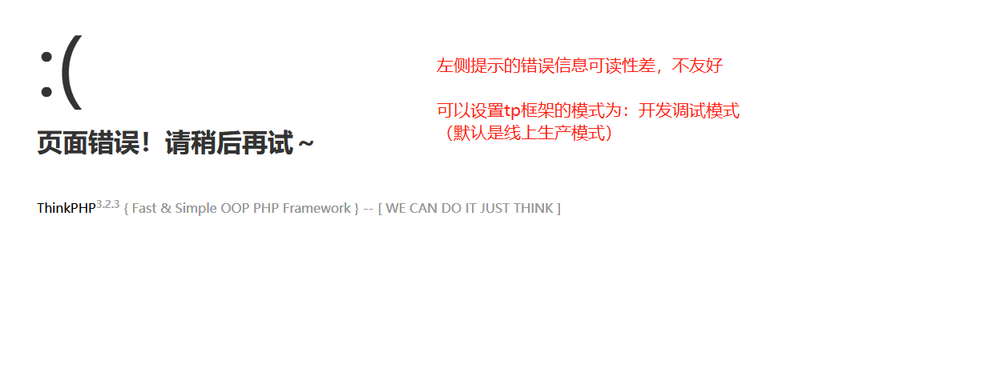
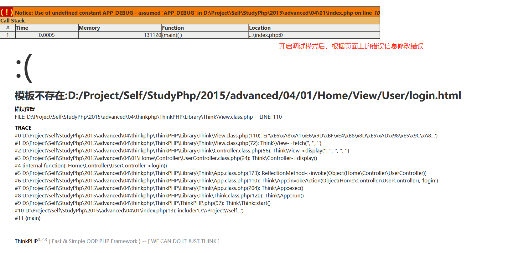
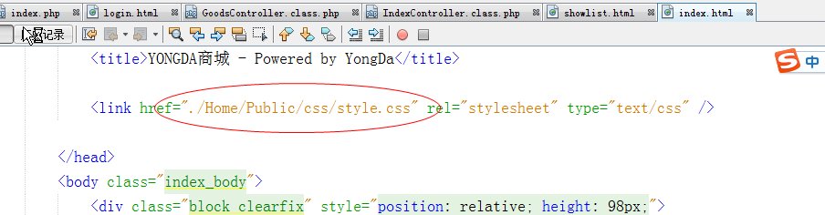
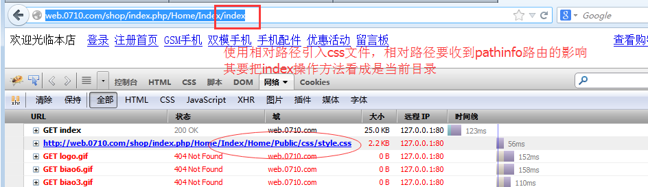
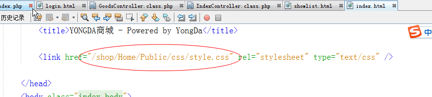

##  01
    学习第一天的知识
##  介绍
    TODO
##  框架文件目录简单介绍
    TODO
##  创建应用
    TODO
##  四种路由形式
    TODO
##  创建控制器
    TODO
##  创建视图模板文件
    使用display()方法调用视图模板：
        视图模板名称默认与当前操作方法一致
        在index.php入口文件中设置常量APP_DEBUG为true
        创建模板文件

##  已有模板与tp框架做结合
    具体实现步骤：
        复制模板文件到View指定目录
        复制css、img、js静态资源文件到系统指定目录
        把静态资源（css、img、js）文件的路径设置为“常量”信息(在index入口文件设置) 
        在模板文件中通过常量引入静态资源（css、img、js）文件
        css文件本身的图片设置，其路径相对css文件本身设置
        后续a、d重复实现即可
    静态资源文件的引入：
        在模板中引入css文件，最好不要使用相对路径，会收到路由的影响
        正确的引入css静态文件的方式最好是“绝对路径”，相对虚拟主机目录的绝对路径

##  创建Admin后台分组
##  搭建管理员登录系统页面
##  后台品字页面搭建
##  后台商品相关页面搭建
##  主要配置文件介绍
##  框架其他两种配置变量体现
##  框架的两种模式
##  开启smarty模板引擎
##  标记符号冲突及为smarty做配置