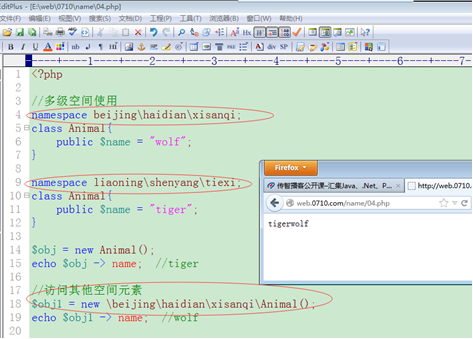
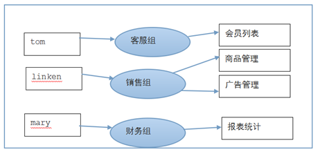

#   01
    学习第一天的知识
##  介绍
    TODO
##  框架文件目录简单介绍
    TODO
##  创建应用
    TODO
##  四种路由形式
    TODO
##  创建控制器
    TODO
##  创建视图模板文件
    使用display()方法调用视图模板：
        视图模板名称默认与当前操作方法一致
        在index.php入口文件中设置常量APP_DEBUG为true
        创建模板文件

##  已有模板与tp框架做结合
    具体实现步骤：
        复制模板文件到View指定目录
        复制css、img、js静态资源文件到系统指定目录
        把静态资源（css、img、js）文件的路径设置为“常量”信息(在index入口文件设置) 
        在模板文件中通过常量引入静态资源（css、img、js）文件
        css文件本身的图片设置，其路径相对css文件本身设置
        后续a、d重复实现即可
    静态资源文件的引入：
        在模板中引入css文件，最好不要使用相对路径，会收到路由的影响
        正确的引入css静态文件的方式最好是“绝对路径”，相对虚拟主机目录的绝对路径

##  创建Admin后台分组
    TODO
##  搭建管理员登录系统页面
    TODO
##  后台品字页面搭建
    TODO
##  后台商品相关页面搭建
    TODO
##  主要配置文件介绍
    ThinkPHP/Conf/convention.php是系统主要配置文件
    项目库/Common/Conf/config.php是项目的配置文件
    项目库/Home/Conf/config.php是项目中Home分组的配置文件
    以上三个配置文件，如果存在同名的配置变量，后者会覆盖前者
    
    系统配置并不是全部配置在convention.php中，只是大部分在这个文件中，在behavior行为文件中也有定义一部分，在框架代码的其它角落也有一部分定义
##  框架其他两种配置变量体现
    C()：大C函数，可以读取或设置配置变量，第一个参数是配置变量名称，第二个参数是要设置的值
    页面底部显示跟踪信息，在项目配置文件中开启SHOW_PAGE_TRACE为true
    默认分组设置：
        设置DEFAULT_MODULE配置变量中的默认分组
        设置MODULE_ALLOW_LIST配置变量中允许访问的分组列表
    开发者调试模式在index.php中头部设置define('APP_DEBUG', true)
##  框架的两种模式
    TODO
##  开启smarty模板引擎
    在config.php中设置配置变量TMPL_ENGINE_TYPE为Smarty
##  标记符号冲突及为smarty做配置
    {}与css或js有冲突解决：
        在{}与内容中间设置空格
        使得{}左右标记不在同一行
        设置{literal}{/literal}
        外部方式引入css、js文件内容
        变换smarty的标记符号
    通过配置变量TMPL_ENGINE_CONFIG设置
#   02
    学习第二天的知识
##  昨天内容回顾
    TODO
##  数据库配置
    /* 数据库设置 */
    'DB_TYPE'               =>  '',     // 数据库类型
    'DB_HOST'               =>  '', // 服务器地址
    'DB_NAME'               =>  '',          // 数据库名
    'DB_USER'               =>  '',      // 用户名
    'DB_PWD'                =>  '',          // 密码
    'DB_PORT'               =>  '',        // 端口
    'DB_PREFIX'             =>  '',    // 数据库表前缀
    'DB_PARAMS'          	=>  array(), // 数据库连接参数    
    'DB_DEBUG'  			=>  TRUE, // 数据库调试模式 开启后可以记录SQL日志
    'DB_FIELDS_CACHE'       =>  true,        // 启用字段缓存
    'DB_CHARSET'            =>  'utf8',      // 数据库编码默认采用utf8
    'DB_DEPLOY_TYPE'        =>  0, // 数据库部署方式:0 集中式(单一服务器),1 分布式(主从服务器)
    'DB_RW_SEPARATE'        =>  false,       // 数据库读写是否分离 主从式有效
    'DB_MASTER_NUM'         =>  1, // 读写分离后 主服务器数量
    'DB_SLAVE_NO'           =>  '', // 指定从服务器序号
##  创建Model类及简单使用
    原则：每个数据表 都对应一个Model模型类，具体与创建Controller控制器相似，就是把Controller字样换成Model即可
    如果有的数据表的前缀与主流前缀不一样，为了避免在实例化model模型类的时候 该english与主流前缀sw_做结合，就可以在EnglishModel模型类里边重写父类属性定义操作的真实数据表名即可
##  两种方式实例化model类对象
    实例化普通model类对象：
        $model =new \XXX\XXXXModel();
        该方式实例化对象可以调用父类Model的一些方法也可以在本身类制作相关方法并调用
    实例化基类model类对象：
        可以实现对数据库的基本操作：
            $model = D(); //实例化基类Model，没有关联任何表
            $model = D(‘Goods’); //实例化基类Model对象,并操作xx_goods业务数据表
            (该方式允许我们即使不创建具体的model模型类文件，也可以对数据表的数据进行操作)
            如果一个数据表没有特殊方法要求，就可以通过D(XXX)进行操作。
            如果数据表有特殊方法要求(例如用户名和密码判断需要一个特殊方法)，就需要在普通model模型类里边定义好，通过new  \Model\XXXModel()形式实例化对象，进而操作特殊方法。
##  数据查询select
    调用方法：model对象->select()
    具体使用：
    	$model -> select();      //查询并返回数据表的全部记录信息
    	$model -> select(主键id值);   //查询主键信息等于条件id值的记录
    	$model -> select(‘id1,id2,id3...’);  //查询主键信息在条件范围内的记录
    	(使用select()方法会始终返回一个二维数组信息)
##  辅助方法操作（1）
    where()条件：$model -> where(条件值);  //条件值就是sql语句where后边的条件信息
    limit()限制条数：$model -> limit(数字);  //严格查询数字条数的记录
    field()限制查询字段：$model -> field(字段1，字段2，字段3);
    order()排序：$model -> order(‘排序条件字段asc/desc’);
    group()分组查询group by：$model -> group(分组条件);
##  辅助方法操作（2）
    having()条件设置方法：having设置查询条件的效果与where使用效果类似
        区别：
            where：语句条件字段，必须是“数据表中存在的”字段
            having：语句条件字段，必须是查询结果集中存在的字段
            where()/limit()/field() 三个方法直接存在于父类Model里边
            having()/order()/group() 三个方法存在于Model的魔术方法__call()里边
            一个对象调用本身类不存在的方法，会自动执行__call()魔术方法
##  辅助方法连贯操作
    以上具体方法在使用的时候可以一并使用多个，形成连贯操作,并且没有顺序要求，例如：
        $obj->limit()->order()->field()->having()->group()->select()
        每个方法执行完毕都把参数信息传递给成员options，该options形成一个数组，系统最后就是依次把options数组的各个元素拼装到基本结构sql语句里边
##  两种添加数据方式add
    调用方法：model对象->add()，具体两种方式使用：
        数组方式
        	$数组 = array(
        		元素(键名=>值)，
        		元素(键名=>值)，
        		。。。。
        	)
        	$model(普通对象) -> add(数组);
        	注意：数组的元素键名与数据表字段的名称必须一致
        AR(Active Record活跃记录)方式
        	$model -> 属性 = 值;   
        	$model -> 属性 = 值;
        	$model ->add();
        	注意：属性值 与 数据表字段一致，否则不给写入数据
            AR规范要求：
            A.一个model模型类与一个具体的数据表对应
            B.model模型类实例化的对象 与 数据表的一条记录对应
            C.model对象的属性 与 记录的字段对应
            TP框架的AR是仿真产品,因为在每个业务/普通Model模型类里边并不存在对应数据表的字段信息。
        add()方法返回新记录的主键id值
##  修改数据及注意save
    调用方法：model对象->save()，与add添加一致具体两种方式使用：
        数组方式
        	$model -> save(数组);
        AR方式
        	$model -> 属性(字段) = 值;
        	$model -> 属性(字段) = 值;
        	$model ->save();
        注意：数组的元素下标(属性字段)必须与数据表字段保持一致
        save()方法返回受影响的记录条数
        mysql本身的语法规则允许一次性修改一个表的全部记录结果
        在实际的项目里边，一般禁止修改数据表的全部数据
        注意：数据修改必须设置条件，主键id 或 where()方法，二选一即可，否则执行失败。
##  后台商品添加的表单展示及收集操作
    TODO
##  后台商品修改的表单展示及收集操作
    pathinfo路由解析方式传递get参数信息格式：
        http:网址/index.php/分组/控制器/操作方法/名称/值/名称/值
    控制器操作方法接收get参数：
        并不是直接使用$_GET接收信息，而是通过方法的形式参数接收。
        function 方法名称($名称,$名称){}：传递的get变量名称与方法形参变量的名称必须一致(形参参数在没有默认值的情况下，每次请求必须传递)
        例如：
            http://网址/index.php/Admin/Goods/upd/goods_id/171/goods_name/htc_two 
            上述url通过pathinfo路由传递了两个get参数信息，在upd操作方法里边要定义形参接收：
            function  upd($goods_id,$goods_name){}
##  删除数据和执行原生sql语句
    $sql = “insert   select  update  delete ......”;
    ① 查询语句：  			$model对象 -> query($sql);    返回一个二维数组结果  
    ② 添加/修改/删除语句：  $model对象 -> execute($sql);   返回受影响记录条数
##  表单验证（用户注册功能实现）
    TODO
##  表单验证具体实现
    TODO
#   03
    学习第三天的知识
##  昨天内容回顾
    TODO
##  命名空间 - 介绍
    什么是命名空间：
        在php程序语言里，语法规则要求同名称的函数、类名、常量在一个请求里面不允许出现多次。
        如果有的应用程序不得已必须出现多个同名的函数、类名、常量，那么我们就可以把它们放到不同的空间里面做请求
        这个不同的空间就称作“命名空间”
    同一个请求里边定义两个同名的函数getInfo()，右图由于有使用命名空间，使得程序可以正常执行

##  命名空间 - 简单使用（三种元素）
    使用命名空间
        通过nameespace关键字声明命名空间：namespace 空间名称
    命名空间针对 函数、类名、const常量 三部分起作用，并统称为“元素”：
        常量的声明：
            define(名称, 值) // （在类外部声明常量）与命名空间没有关系
                            // 同名称常量只能define一次
            const 名称 = 值 // 与命名空间有关系
                            // const可以在类的内部声明常量信息（类常量）
                            // const也可以在类外部声明常量（正常常量）
            使用命名空间的时候，const可以放到类外部声明常量
            同名称的多个常量，可以分别定义到不同的“命名空间”里面
    const和define的区别：
        前者针对命名空间发生影响，后者不发生影响
        const可以声明多个同名称的常量
        define队同名称常量只能声明一个

##  命名空间 - 多级空间及三种方式访问元素
    子级（多级）空间
        命名空间可以让我们存放许多元素（函数、类、常量），有时候元素比较多，为了管理方便，可以对元素进行分门别类地存储
        也就是说命名空间可以设置为多级空间
        多级空间的最后一级就被称为子级空间
    空间元素访问的三种形式：
        非限定名称：
            echo Animal:$name
            就近访问上边与其挨着的最近空间的Animal元素（类似于php引入文件：include "common.php"，相对路径引入当前目录下的文件）
        限定名称：
            echo beijing\Animal:$name
            把当前空间和beijing空间联合获得Animal元素（类似于php引入文件：include "Common/Conf/config.php"，相对路径）
        完全限定名称：
            echo \beijing\Animal:$name
            访问beijing空间的Animal元素（类似于php引入文件：include "d/web/1121/Conf/common.php"， 绝对路径引入文件）

##  命名空间 - 引入机制（空间引入）
    引入机制：
        命名空间可以声明为多级空间，这个多级空间元素在其他空间内部访问的时候，不得已需要通过完全限定名称方式访问
        完全限定名称不方便开发、维护，为了降低代码的复杂度，可以在当前的空间把指定的空间给引入进来，进而可以方便地通过“限定名称”的方便的形式使用其它空间的元素
    空间引入：use 空间名称

##  命名空间 - 引入机制（类元素引入和别名设置）
    类元素引入：
        use 空间\空间\空间\类元素
        空间引入可以解决完全限定名称访问元素的繁琐性，但是还需要通过“限定名称”方式访问，仍然不够简便
        如果引入空间的元素是类，就可以直接把这个类引入到当前控件，使用的时候也就可以通过“非限定”名称方式访问，非常便捷（只能做类元素引入，函数和常量不可以）
    别名使用：
        use 空间\元素 as 别名
        把其它空间的一个类元素引入到当前空间，如果当前控件也有一个同名的类元素，则引入元素与当前空间元素就会有冲突，为了避免冲突发生，可以给引入空间元素起一个别名

##  命名空间 - 公共空间和注意事项
    一个php文件里没有namespace关键字声明，则该文件的元素都存在于“公共空间”
    访问公共空间的元素统一设置为：\元素
        通过“非限定名称”访问访问一个元素(函数、常量)
            首先获得本空间元素
            其次获得公共空间元素
    命名空间使用注意：
        声明命名空间的当前脚本的第一个namespace关键字前面不能有任何代码（header头代码也要写在下边）
        命名空间是虚拟抽象的空间，不是真实存在的目录
        同一请求的多个文件可以使用同名称的命名空间，只要这些文件里面不出现多个同名称、同类型的元素就可以

##  命名空间 - tp框架的命名空间体现
    TODO
##  显示验证码
    若页面无法显示验证码图片，在函数头部添加以下两句代码，清除和重新设置html头部信息：
        ob_clean();
        header("Content-type: image/png");
    thinlphp框架显示验证码直接实例化Verify工具类（new \Think\Verify），传入图片参数，用entry()函数输出
##  登陆页面显示验证码
    TODO
##  校验验证码
    使用工具类Verify的check()函数验证
##  实现给商品上传图片功能
    实例化TP框架中的Upload工具类
##  缩略图效果实现
    原理：
        把一个已有图片的打开
        裁剪出已有图片的某个部分，该部分经过放大、缩小的处理
        之后再把处理好的部分放到另外一个图片里边显示出来。具体使用imagecopyresampled函数实现
    涉及技术点：
        打开一个已有图片:imagecreatefromjpeg()  imagecreatefrompng()  
        创建一个目标图片(白板):imagecreatetruecolor()
        对图片的一部分进行缩放处理：imagecopyresampled();
##  在模板中显示图片
    TODO
##  制作一个分页的工具类
    TODO
##  利用分页工具类实现分页效果
    TODO
##  后台管理员登录系统实现
    TODO
#   04
    学习第四天的知识
##  昨天内容回顾
    TODO
##  RABC - 两种权限分配介绍
    RBAC: role  base  access  control  基于角色的用户访问权限控制
    传统方式权限设置：
        具体操作权限与用户直接联系
        管理员需要为新增、离职的用户进行具体权限分配，操作的时候效率低下、权限设置没有统一标准，较凌乱，不适合大项目使用
    基于角色的权限分配：
        用户----->组(角色)------>权限
        用户和组(角色)对应，组和权限对应
        管理员进行权限设置只需要考虑用户是哪个组的即可，操作非常容易、高效、简便
        是一种非常科学的权限设置方式

##  RABC - 数据表设计

##  RABC - 数据模拟

##  RABC - 用户登录系统显示对应权限
    TODO
##  RABC - admin超级管理员显示全部权限
    TODO
##  RABC - 角色列表展示
    TODO
##  RABC - 角色分配权限（表单展示）
    TODO
##  RABC - 给角色分配权限（收集表单）1
    TODO
##  RABC - 给角色分配权限（收集表单）2
    TODO
##  RABC - 给角色分配权限（显示已经拥有权限）
    TODO
##  RABC - 维护（列表展示）
    TODO
##  RABC - 添加权限（表单展示）
    TODO
##  RABC - 添加权限（收集表单及数据入库）
    TODO
##  RABC - 禁止翻墙访问（制作新父类AdminController）
    TODO
##  RABC - 禁止翻墙访问（AdminController构造方法做限制）
    TODO
##  RABC - 未登录系统用户跳到登陆页面
    TODO