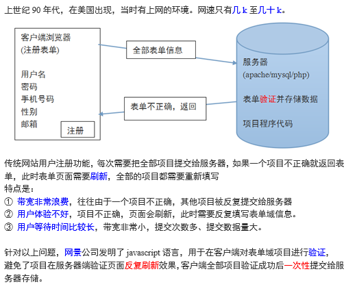
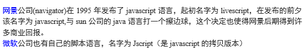
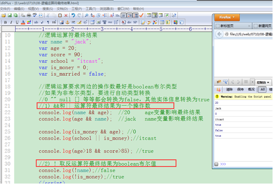
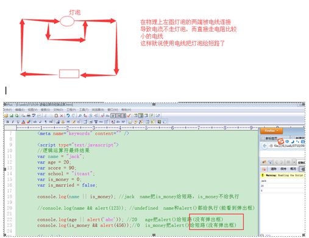

>author：MierX

>github：[StudyPhp](https://github.com/MierX/StudyPhp)

>create：21.4.16 17:31

>motto ：有志者，事竟成
---
#   01
    学习第一天的知识
##  JS高级 - 介绍
    JS定义：
        基于事件和对象驱动，并具有安全性能的脚本语言
        该语言运行在客户端浏览器里边，也有运行在服务器端的名称为“node.js”

##  JS高级 - 基本语法规范
    在html代码里引入js语言
        
        
    代码大小写敏感
        true/false 布尔值
        TRUE/FALSE 非布尔值
        php语言大小写敏感（函数名、类名、类方法名称不敏感）
    结束符号
        每个简单语句使用';'分号结束，与php类似
        在javascript里面，分号不是必须的，但建议使用
    注释
        // 单行注释
        /* 多行注释 */
    变量
        其值可以发生改变的量就是变量
        变量是内存中运行的最小单位
        变量命名规则：字母、数字、下划线、$符号、汉字，数字不能作为变量名的开头
    数据类型
        number（int/float）、string、boolean、null、undefined、object（数组是对象的一部分）
    typeof判断变量的数据类型
##  JS高级 - number数值数据类型
    各种进制数表示
        十进制：var age = 23
        八进制：var score = 023
        十六进制：var color = 0x23
    浮点数
        带小数点的数
    最大数、最小数
        最大：Number.MAX_VALUE
        最小：Number.MIN_VALUE
    无穷大的数
        infinity
##  JS高级 - 算数和比较运算符
    算数运算符
        +（加）、-（减）、*（乘）、/（除）、%（取余、模）、++（自加1、自增1）、--（自减1）
        注意：++i、i++在赋值的情况下是有区别的
    比较运算符
        >（大于）、<（小于）、>=（大于等于）、<=（小于等于）、!=（值不等于）、==（值等于）、===（值、类型全等于）、!==（值、类型全不等于）
##  JS高级 - 逻辑运算符
    逻辑与
        &&：两边结果都为真，结果为真
    逻辑或
        ||：两边结果只有有一个为真，结果为真
    逻辑取非
        !：真即假，假即真
    注意点：
        逻辑运算符最终结果：
            在php里面，最终结果是布尔类型的值
            在js里面，&&和||的结果是其中一个操作数（最终影响结果的那个操作数），!是布尔结果
        短路运算：
            前一个操作数已经可以决定最终结果，后边的操作数就不会执行，其被短路
            只给执行一个操作数，不执行另一个操作数，不被执行的操作数就被短路
        加号运算符：
            两个意思：
                算数加法运算符（两边操作数都需要为是Number数值类型）
                字符串连接运算符（只要有一个操作数为字符串类型就做连接运算）

##  JS高级 - 流程控制（switch和break-continue）
##  JS高级 - 函数的两种声明方式
##  JS高级 - 实参与形参的对应关系
##  JS高级 - arguments关键字灵活接收实参
##  JS高级 - callee关键字降低代码耦合度
##  JS高级 - return返回值
##  JS高级 - 匿名函数自调用
##  JS高级 - 全局和局部变量
##  JS高级 - 三种方式声明数组
##  JS高级 - 数组长度（遍历常用方法）
##  JS高级 - 字符串调用成员原理
##  JS高级 - eval语法结构使用
#   02
    学习第二天的知识
##  JS高级 - 昨天内容回顾
##  JS高级 - DOM介绍
##  JS高级 - DOM获取元素节点对象
##  JS高级 - DOM获取文本节点对象
##  JS高级 - DOM子节点和兄弟节点获取
##  JS高级 - DOM属性值和属性节点操作
##  JS高级 - DOM节点创建和追加操作
##  JS高级 - DOM节点复制和删除
##  JS高级 - DOMcss样式的获取和设置
##  JS高级 - DOM2级事件设置
##  JS高级 - DOM2级事件取消操作
##  JS高级 - 事件流操作
##  JS高级 - 获取事件对象
##  JS高级 - 事件对象作用（获得鼠标坐标、阻止事件流、感知触发的键子）
##  JS高级 - 事件对象作用（组织浏览器默认动作）
##  JS高级 - 加载时间onload
##  JS高级 - BOM浏览器对象模型（显示时钟）
#   03
    学习第三天的知识
##  JS高级 - 昨天内容回顾
##  JS高级 - 昨天作业总结
##  JS高级 - 什么是作用域链
##  JS高级 - 作用域链的三个作用
##  JS高级 - 作用域链的作用
##  JS高级 - AO活动对象
##  JS高级 - 变量类型及优先级
##  JS高级 - 重新认识全局变量和局部变量
##  JS高级 - 闭包特点及原理
##  JS高级 - 闭包使用规则
##  JS高级 - 闭包案例（创建数组元素）
##  JS高级 - 闭包案例（事件操作）
##  JS高级 - 面向对象介绍
##  JS高级 - 三种方式创建对象
##  JS高级 - 对象在内存的分配
##  JS高级 - 对象调用其他函数或方法
##  JS高级 - call和apply使得函数执行
##  JS高级 - this的代表、构造器、return的影响
#   04
    学习第四天的知识
##  JS高级 - 昨天内容回顾
##  JS高级 - 昨天作业总结
##  JS高级 - 封装性（私有成员）
##  JS高级 - 原型继承具体实现
##  JS高级 - 原型继承注意
##  JS高级 - 对象访问成员类型及优先级
##  JS高级 - 原型链
##  JS高级 - 遍历对象及成员属组判断
##  JS高级 - 复制继承
##  JS高级 - 静态成员
##  JS高级 - 异常
##  JS高级 - 多态
##  JS高级 - 正则的介绍及简单使用
##  JS高级 - 正则的定义字符集组成
##  JS高级 - 正则的特别字符集组成1
##  JS高级 - 正则的特别字符集组成2
##  JS高级 - 正则的特别字符集组成（小括号使用）
##  JS高级 - 正则的模式修正符
#   05
    学习第五天的知识
##  JS高级 - 昨天内容回顾
##  JS高级 - 昨天作业总结
##  JS高级 - 小括号模式单元重复使用
##  JS高级 - 组合和限制字符
##  JS高级 - 正向（反向）预查
##  JS高级 - 正则案例（验证ip、邮箱、表单域邮箱信息）
##  JS高级 - 贪吃蛇：绘制地图
##  JS高级 - 贪吃蛇：绘制食物
##  JS高级 - 贪吃蛇：绘制小蛇
##  JS高级 - 贪吃蛇：移动小蛇
##  JS高级 - 贪吃蛇：控制小蛇方向
##  JS高级 - 贪吃蛇：吃食物增加蛇节、生成新食物
##  JS高级 - 贪吃蛇：控制小蛇的移动范围