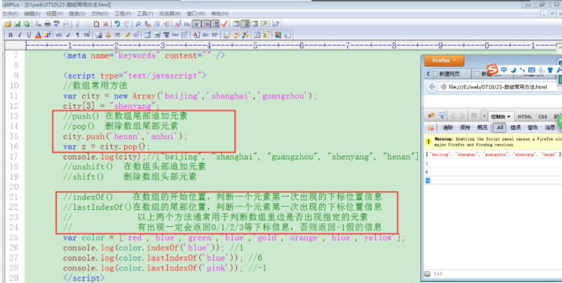
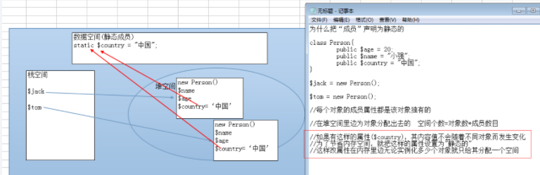
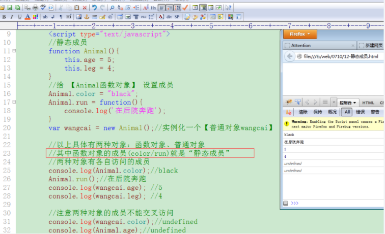
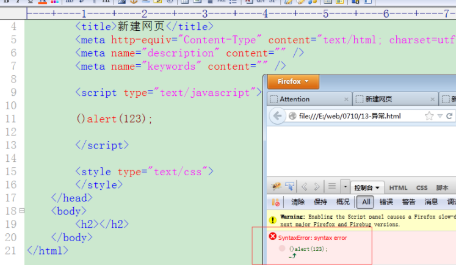

>author：MierX

>github：[StudyPhp](https://github.com/MierX/StudyPhp)

>create：21.4.16 17:31

>motto ：有志者，事竟成
---
#   01
    学习第一天的知识
##  JS高级 - 介绍
    JS定义：
        基于事件和对象驱动，并具有安全性能的脚本语言
        该语言运行在客户端浏览器里边，也有运行在服务器端的名称为“node.js”


##  JS高级 - 基本语法规范
    在html代码里引入js语言
        <script type="text/javascript">具体js代码</script>
        <script type="text/javascript" src="js文件"></script>
    代码大小写敏感
        true/false 布尔值
        TRUE/FALSE 非布尔值
        php语言大小写敏感（函数名、类名、类方法名称不敏感）
    结束符号
        每个简单语句使用';'分号结束，与php类似
        在javascript里面，分号不是必须的，但建议使用
    注释
        // 单行注释
        /* 多行注释 */
    变量
        其值可以发生改变的量就是变量
        变量是内存中运行的最小单位
        变量命名规则：字母、数字、下划线、$符号、汉字，数字不能作为变量名的开头
    数据类型
        number（int/float）、string、boolean、null、undefined、object（数组是对象的一部分）
    typeof判断变量的数据类型
##  JS高级 - number数值数据类型
    各种进制数表示
        十进制：var age = 23
        八进制：var score = 023
        十六进制：var color = 0x23
    浮点数
        带小数点的数
    最大数、最小数
        最大：Number.MAX_VALUE
        最小：Number.MIN_VALUE
    无穷大的数
        infinity
##  JS高级 - 算数和比较运算符
    算数运算符
        +（加）、-（减）、*（乘）、/（除）、%（取余、模）、++（自加1、自增1）、--（自减1）
        注意：++i、i++在赋值的情况下是有区别的
    比较运算符
        >（大于）、<（小于）、>=（大于等于）、<=（小于等于）、!=（值不等于）、==（值等于）、===（值、类型全等于）、!==（值、类型全不等于）
##  JS高级 - 逻辑运算符
    逻辑与
        &&：两边结果都为真，结果为真
    逻辑或
        ||：两边结果只有有一个为真，结果为真
    逻辑取非
        !：真即假，假即真
    注意点：
        逻辑运算符最终结果：
            在php里面，最终结果是布尔类型的值
            在js里面，&&和||的结果是其中一个操作数（最终影响结果的那个操作数），!是布尔结果
        短路运算：
            前一个操作数已经可以决定最终结果，后边的操作数就不会执行，其被短路
            只给执行一个操作数，不执行另一个操作数，不被执行的操作数就被短路
        加号运算符：
            两个意思：
                算数加法运算符（两边操作数都需要为是Number数值类型）
                字符串连接运算符（只要有一个操作数为字符串类型就做连接运算）


##  JS高级 - 流程控制（switch和break-continue）
```javascript
switch (变量) {
    case 常量:
        分支;
        break;
    case 常量:
        分支;
        break;
    case 常量:
        分支;
        break;
    default:
        分支;
        break;
}
switch (变量) {
    case 条件判断表达式:
        分支;
        break;
    case 条件判断表达式:
        分支;
        break;
    case 条件判断表达式:
        分支;
        break;
    default:
        分支;
        break;
}
```
    break：在循环、switch中使用，结束当前的本层循环，跳出switch的分支结构
    continue：在循环里面使用，跳出本次循环，进入下次循环
    通过标志位设置，可以使得break和continue的作用效果发生改变：
        for1
            flag:
            for2
             cat:
             for3
                break flag; // 把flag标志的循环结束


##  JS高级 - 函数的两种声明方式
    什么是函数：有一定功能的代码体的集合
    函数的封装：
        传统方式：
            function 函数名(){}
            函数先调用、后声明的条件是：全部代码在同一个<script></script>标记里面
        变量赋值方式声明函数（匿名函数使用）
            var 函数名 = function(){}
            在javascript里面，函数就是一个变量，数据类型是对象
            该方式没有“预加载”，必须（先声明，后调用）

##  JS高级 - 实参与形参的对应关系
    function 函数名(name, age, city = 'beijing'){}
    函数名('tom', 23, 'guangzhou'); // 传递实参信息


##  JS高级 - arguments关键字灵活接收实参
    function  函数名(){}  //函数声明没有形参
    函数名(实参，实参);  //调用的时候有传递实参
    利用arguments可以在函数里边接收实参信息。

##  JS高级 - callee关键字降低代码耦合度
    callee关键字：在函数内部使用，代表当前函数的引用（名字），可以降低代码的耦合度
    耦合度：一处代码的修改会导致其他代码也要发生改变(耦合度高)
    function f1(){
        arguments.callee();   //调用本函数（或者f1()）
    }
    f1();
##  JS高级 - return返回值
    function 函数名称(){
        函数执行体代码...
        return  信息;
    }
    console.log(函数名称()); //可以输出函数的return信息
    var rst = 函数名称(); //可以使得return信息对变量进行赋值
    
    一个函数执行完毕可以通过return关键字返回一定的信息，该信息可以直接输出，也可以进行变量赋值
    return本身还有结束函数执行的效果
    在一定意义上看，全部的数据类型（数值、字符串、布尔、对象、null）信息都可以用返回（undefined类型无需返回，本身无意义）
    在js中，return除了可以返回基本类型的信息，还可以返回function函数
    在js中，一切都是对象
    在一个函数内部，可以声明数值、字符串、布尔、对象等局部变量信息，言外之意就还可以声明函数（函数内部嵌套函数）变量信息，因为函数是对象，并且函数可以被return给返回出来


##  JS高级 - 匿名函数自调用

##  JS高级 - 全局和局部变量
    全局变量：
        php：
            函数外部声明的变量
            在函数内部也可以声明全局变量（函数调用之后起作用）
        js：
            在函数外部声明的变量
            在函数内部不使用“var”声明的变量（函数调用之后起作用）
    局部变量：
        php：在函数内部声明的变量
        js：在函数内部用“var”关键字声明的变量


##  JS高级 - 三种方式声明数组
    三种方式：
        ①：var arr = [元素, 元素, 元素, 元素, ...];
        ②：var arr = new Array(元素, 元素, 元素, 元素, ...);
        ③：var arr = new Array();
            arr[0] = 元素;
            arr[1] = 元素;
            arr[2] = 元素;
            ......
        注意：
            js数组的下标都是数字
            前两种方式声明的数组各个元素不能手动设置下标
            第三种方式可以给数组逐一设置下标
                数字下标就是数组部分
                字符串下标就是对象的成员属性
            js的数组本身是一个对象，内部有数组元素部分也有对象成员部分

##  JS高级 - 数组长度（遍历常用方法）
    arr.length; // 获得数组元素个数和
    数组遍历：
        沿着一定的顺序对数组内部的元素做一次且仅做一次访问，称作遍历
            for循环遍历：适合遍历下标是规则连续的数组
            for-in遍历：对下标没有具体要求，可以遍历数组、对象


##  JS高级 - 字符串调用成员原理
    通过(单/双)引号把键盘上用于显示的一些信息给括起来，就是一个字符串

##  JS高级 - eval语法结构使用
    eval(字符串)：
        该eval可以把内部参数字符串当成表达式，在上下文环境中运行
        该eval经常用于把其他用户传递过来的字符串信息转变为js的实体（对象、数组）信息

#   02
    学习第二天的知识
##  JS高级 - 昨天内容回顾
    TODO
##  JS高级 - DOM介绍
    dom：document object model（文档对象模型）
    DOM技术：
        php：php与xml/html标签之间沟通的一个桥梁
        js：js与xml/html标签之间沟通的一个桥梁
    作用：DOM可以让我们通过js对HTML文档进行增删改查的操作
    为了方便js通过DOM操作html文档比较方便，把html文档的各个组成内容划分为各种节点（对象）：
        文档节点（document）：html根节点的父节点
        元素节点
        文本节点
        属性节点
        注释节点


##  JS高级 - DOM获取元素节点对象
    方法：
        document.getElementById(id属性值)：每次只返回一个具体元素节点对象
        document.getElementsByTagName(tag标签名称)：每次返回一个集合列表对象，可以通过下标方式获取具体元素对象
        document.getElementsByName(name属性值)：该方法不推荐使用，有浏览器兼容问题

##  JS高级 - DOM获取文本节点对象
    获取文本节点首先获得元素节点对象，再通过元素节点对象获得其内部的文本节点
    元素节点.firstChild：获得元素节点内部的第一个子节点
    文本节点.nodeValue：获得文本节点对应的文本信息

##  JS高级 - DOM子节点和兄弟节点获取
    firstChild、lastChild:父节点获得第一个/最后一个子节点
    nextSibling:获得下一个兄弟节点
    previousSibling:获得上一个兄弟节点
    childNodes:父节点获得内部全部的子节点信息
    length: 获得“集合列表”的长度
    以上属性在主流浏览器(火狐firefox、chrome、safari、opera、IE9以上)中会给考虑空白节点(回车、空格)。在IE(6/7/8)浏览器中不考虑空白节点。
    空白节点本质：其是文本节点


##  JS高级 - DOM属性值和属性节点操作
    属性值操作：
        获取属性值：
            元素节点node.属性名称; //只能操作w3c规定的属性
            元素节点node.getAttribute(属性名称); //规定的 和 自定义的属性都可以获取
        修改属性值：
            元素节点node.属性名称 = 值; //只能操作w3c规定的属性
            元素节点node.setAttribute(名称，值); //规定的 和 自定义的属性都可以设置


##  JS高级 - DOM节点创建和追加操作
    节点创建：
        元素节点：document.createElement(tag标签名称)
        元素节点：document.createTextNode(文本内容)
        属性设置：node.setAttribute(名称, 值)
    节点追加：
        父节点.appendChild(子节点)
        父节点.insertBefore(newnode, oldnode)：把newnode放到oldnode前边
        父节点.replaceChild(newnode, oldnode)：把oldnode替换为newnode


##  JS高级 - DOM节点复制和删除
    节点复制：
        被复制节点.cloneNode(true/false)：
            true：深层复制（本身节点和其内部节点）
            flase：浅层复制（本身节点）
    节点删除：
        父节点.removeChild(子节点)
        子节点.parentNode.removeChild(子节点)


##  JS高级 - DOMcss样式的获取和设置
    <div style=”width:300px;height:200px; background-color:pink;”></div>
    获取css样式：元素节点.style.css样式名称
    设置（修改）css样式：元素节点.style.css央视名称 = 值
    注意：
        dom操作与css样式只能操作“行内样式”（css样式分为行内、内部、外部）
        操作复合样式（background-color/border-left-color）需要将中间的横线去掉后边的首字母大写
        修改样式，有则修改，无则新增，修改后的样式会变为行内样式

##  JS高级 - DOM2级事件设置
    事件：
        通过鼠标、键盘对浏览器页面所作的动作就是事件；
        事件一旦发生需要有事件处理，该处理称为“事件驱动”，事件驱动通常由js函数担任
        事件触发：
            onclick：鼠标点击
            onmouseover：鼠标移入
            onkeyup：键盘按下并抬起
            onkeydown：键盘按下
            onchange：内容改变
            onblur：失去焦点
            onfocus：获得焦点
            onsubmit：表单提交
    设置事件：
        dom一级方式设置：
            ①：
                <input  type=”text”  onclick=”函数名称()” />
            	function 函数名称(){this[window]}
            ②：
                <input  type=”text” onclick=”过程代码this[itnode]” />
            ③：
                itnode.onclick = function(){this[itnode]}  // 匿名函数
            ④：
                itnode.onclick = 函数名称; // 有名函数
                function 函数名称(){this[itnode]}
            取消dom一级事件：itnode.onlick = null
            以上是dom1级事件设置的4种具体表现形式，this关键字除了第①种其代表window对象，其他三种都代表事件节点对象本身。
        dom二级方式设置：
            主流浏览器方式（包括IE9以上）：
                设置：itnode.addEventListener(事件类型, 事件处理[, 事件流])
                取消：itnode.removeEventListener(事件类型, 事件处理[, 事件流])
            IE浏览器方式（IE6/7/8）：
                设置：itnode.attachEvent(事件类型, 事件处理)
                取消：itnode.detachEvent(事件类型, 事件处理)
            事件类型：
                就是我们可以设置的具体事件（onclik/onmouseover等）
                主流浏览器方式没有“on”标志，例如addEventListener('click', ...)
                IE浏览器没有“on”标志
            事件驱动：事件驱动是一个有名（匿名）函数
            事件流：
                true：捕捉型
                false：冒泡型
            dom二级事件设置的特点：
                可以为同一个对象设置多个同类型事件
                事件取消也非常灵活
                对事件流也有很好的处理控制
##  JS高级 - DOM2级事件取消操作
    事件取消操作具体要求：
        事件处理必须是有名函数，不可以是匿名函数
        事件取消的参数与绑定的参数完全一致


##  JS高级 - 事件流操作
    事件流：多个彼此嵌套元素，他们用有相同的事件，最内部元素事件被触发后，外部多个元素的同类型事件也会被触发
    事件流类型：
        冒泡型：时间从内部往外部依次执行
        捕捉型：事件从外部从内部依次执行


##  JS高级 - 获取事件对象
    事件对象，每个事件（包括鼠标、键盘事件）触发执行的过程中，都有对应的事件对象，通过事件对象可以获得鼠标相对于页面的坐标信息，也可以感知键盘哪个键子被触发，通过事件对象还可以阻止事件流产生、阻止浏览器默认动作
    获得事件对象：
        主流浏览器（IE9以上版本浏览器）：
            事件处理函数的第一个形参就是事件对象
            node.onclick = function(evt){};
            addEventListener(类型, function(evt){});
            function 函数名称(evt){};
            evt就是事件对象
        IE（6/7/8）浏览器：
            node.click = function()(window.event事件对象)
            全局变量event就是事件对象
            全局变量直接上级对象是window，可以通过window访问全局变量
            window.document.getElementById()

##  JS高级 - 事件对象作用（获得鼠标坐标、阻止事件流、感知触发的键子）
    获得鼠标的坐标信息：
        event.clientX/clientY：相对DOM区域的X/Y坐标
        event.pageX/pageY：相对DOM区域，结合计算滚动条距离的X/Y坐标
        event.screenX/screenY：相对屏幕的X/Y坐标
    阻止事件流：
        主流浏览器：event.stopPropagation()
        IE（6/7/8）：window.event.cancelBubble = true
        冒泡型、捕捉型都可以进行阻止，为了阻止比较有意义，只考虑冒泡型即可
    感知被触发键盘键子信息：
        event.keyCode：获得键盘对应的键值码信息


##  JS高级 - 事件对象作用（组织浏览器默认动作）
    阻止浏览器默认动作：
        浏览器默认动作，如提交表单的时候，浏览器的页面会根据action属性值进行跳转
        主流浏览器：event.preventDefault()
        IE（6/7/8）：event.returnValue = false

##  JS高级 - 加载事件onload
    加载事件：
        js代码执行时，需要html&css的支持，让html代码先执行（先进入内存），js代码后执行
        js代码在最后执行的过程就是“加载过程”，通常通过“加载事件”实现加载过程
        具体设置：
            <body onload="加载函数()">
            window.onload = 匿名/有名函数

##  JS高级 - BOM浏览器对象模型（显示时钟）
    DOM：document object model（文档对象模型）
    BOM：browser object model（浏览器对象模型）
    通过BOM技术可以模拟浏览器对页面进行各种操作：
        创建子级标签页面
        操作历史记录页面
        操作地址栏


#   03
    学习第三天的知识
##  JS高级 - 昨天内容回顾
    TODO
##  JS高级 - 昨天作业总结
    TODO
##  JS高级 - 什么是作用域链
    定义：变量在当前环境、内部环境、内部深层环境……都起作用的现象形成了一个链条，这个链条就被称为变量的作用域链

##  JS高级 - 作用域链的三个作用
    变量必须“先声明，后使用”，原因是函数有“预加载”过程
    内部环境可以访问外部环境的变量，反之不然，每个函数内部都是一个环境，最外边则是全局环境


##  JS高级 - 作用域链的作用
    变量的作用域是声明时决定的，而不是运行时

##  JS高级 - AO活动对象
    AO：Active Object（活动对象（抽象的概念））
    执行环境：
        js代码执行是有环境的（全局环境、函数内部环境）
        环境定义了其有权访问的其他数据
        环境有一个与之关联的“活动对象AO”
        环境中所有的变量和函数都是活动对象AO的成员
        全局环境是最外围的执行环境，活动对象是window对象
        执行环境中的代码执行完毕后被销毁

##  JS高级 - 变量类型及优先级
    内部变量 > 内部函数 > 形参 > 外部变量（变量/函数/形参）

##  JS高级 - 重新认识全局变量和局部变量
    全局变量：
        声明：
            在函数外部声明的变量
            在函数内部不使用var声明的变量（前提是函数执行之后才起作用）
        全局变量是活动对象window的成员信息
    局部变量：
        声明：
            在函数内部通过var声明的变量就是局部变量
        重新认识：
            局部变量相对概念上，在一定范围内可以看作是“全局变量”
            其在本环境、内部环境、内部深层环境都可以被访问

##  JS高级 - 闭包特点及原理
    什么是闭包：
        闭包就是一个函数，两个函数彼此嵌套，内部函数就是闭包
        形成闭包条件就是内部函数需要通过return给返回出来
        特点：
            闭包有权利调用其上级环境的变量信息
            父级环境的信息已经固化为本身AO的成员了


##  JS高级 - 闭包使用规则
    同一个闭包机制可以创建多个闭包函数出来，它们彼此没有联系，都是独立的，并且每个闭包函数可以保存自己个性化的信息

##  JS高级 - 闭包案例（创建数组元素）
    TODO
##  JS高级 - 闭包案例（事件操作）
    TODO
##  JS高级 - 面向对象介绍
    php：从一个类里获得一个具体对象
    js：没有类的概念，可以直接创建一个对象（或通过函数）出来，对象可以有默认成员，后期也可以给对象丰富成员
##  JS高级 - 三种方式创建对象
    字面量方式创建：var obj = {成员名称:值, 成员名称:值, 成员名称:值, ...}
    构造函数创建对象：var obj = new 函数名称()
    Object方式创建对象：var obj = new Object()


##  JS高级 - 对象在内存的分配
    与对象有关系的内存空间：
        栈空间：
            存放的数据大小比较小，一般大小固定的信息适合存放在该空间，例如整型、boolean
            对象的名称（引用）
        堆空间：
            该空间存储的数据比较多，空间比较大，一般数据长度不固定的信息在该空间存放，例如string、Array、对象实体
        数据空间：
            该空间存放常量、类的静态属性
        代码空间：
            存放函数体代码、方法体代码


##  JS高级 - 对象调用其他函数或方法
    TODO


##  JS高级 - call和apply使得函数执行
    构造函数与普通函数的区别：没有区别，就看使用，new就是构造函数，函数()就是普通函数调用
    函数的各种执行方式：
        普通函数调用（包括匿名函数自调用）
        构造函数执行new函数
        作为对象的成员方法执行
        通过call和apply执行：
            函数/方法.call(函数内部this指引,实参,实参, ...)
            函数/方法.apply(函数内部this指引, [实参,实参, ...])
            call和apply使得函数执行的时候可以控制变量污染的风险（对象调用其他函数/方法的时候，无需为对象创建新成员）


##  JS高级 - this的代表、构造器、return的影响
    this的代表：
        在函数/方法里面，this代表调用该函数/方法的当前对象
        在事件中，this代表元素节点对象：
            inputnode.onclick = function() {
                alert(this.value);
            }
        代表window
        可以任意代表其他对象
            在call和apply使用的时候，可以任意设置被执行函数内部this的代表
    获取构造器：
        构造器：使用什么元素实例化的对象，元素就被称为该对象的构造器（php类/js函数）
            var cat = new Animal()：Animal就是cat对象的构造器
        对象.constructor：获取对象的构造器


#   04
    学习第四天的知识
##  JS高级 - 昨天内容回顾
    TODO
##  JS高级 - 昨天作业总结
    TODO
##  JS高级 - 封装性（私有成员）
    面向对象三大特性：封装、继承、多态
    封装特性：
        php：
            在php里面，通过给成员声明关键字（public、protected、private）提现封装
            php中有2种方式访问私有成员属性private：
                定义一个公开方法
                通过魔术方法__get()
        js：
            在js里面，封装只体现public、private
                public公开的，在构造函数里面通过this关键字声明的成员都是公开的，函数内部、外部都可以调用
                private私有的，在构造函数里边声明局部变量，就是私有成员

##  JS高级 - 原型继承具体实现
    php：一个类去继承另一个类，继承类实例化对象也会拥有被继承类的成员
    js：(构造)函数可以继承另外一个对象，构造函数实例化出来的对象除了拥有本身成员还拥有被继承对象的成员
        原型继承关键字：prototype
    方法：
        函数.prototype.成员名称 = 值：继承单一成员
        函数.prototype = 对象：继承一个对象


##  JS高级 - 原型继承注意
    对象和单一成员同时继承，需要先继承对象、再继承成员
    多个对象同时继承，最后一个继承对象起作用
    继承成员名称与本身成员名称一致，最终体现本身成员的结果


##  JS高级 - 对象访问成员类型及优先级
    对象本身成员 > 构造函数成员 > 继承对象本身成员 > 继承对象构造函数成员

##  JS高级 - 原型链
    什么是原型链：
        构造函数继承一个对象，继承对象也有构造函数，其构造函数继承其他对象，其他对象的构造函数继续继承其他对象，如此反复，形成了一个继承的链条，被称为原型链
        原型链的顶端是Object
    对象访问一个成员顺序：
        1.对象本身获取
        2.对象构造函数里面获取
        3.构造函数继承对象本身获取
        4.构造函数继承对象的构造函数里面获取
        5.构造函数继承对象构造函数继承对象的本身获取
        6.构造函数继承对象构造函数继承对象的构造函数里面获取
        ......
        n.直到找到object成员位置
        有的时候对象访问一个成员，我们本身并没有定义这个成员，其就会通过原型链找到顶端Object的成员进行访问。例如constructor、hasOwnPrototype、isPrototypeOf等等都是原型链顶端Object的成员。

##  JS高级 - 遍历对象及成员属组判断
    for-in：
        for (var 成员变量 in 对象) {}
    判断成员是自身的还是继承的：对象.hasOwnProperty(成员变量)

##  JS高级 - 复制继承
    原型衍生继承：复制继承：
        特点：
            允许同时继承多个对象
            非常灵活，可以根据实际需要为每个对象复制不同的成员（之前的原型继承，继承成员无论是否使用都继承给每个对象）
        jQuery框架里边大量使用复制继承

##  JS高级 - 静态成员
    如果一个类里面有这样的属性：其值不随便发生变化，全部对象都共用一个值，该属性就声明为static静态的，其在内存中无论创建多少个对象（或者说其与集体对象无关）都只占据一份空间
    为什么使用静态成员：
        静态成员归属到类本身，可以明显的加快访问速度（不需要实例化对象，通过类进行访问）
        节省内存：
            一个类每实例化一个对象，在堆空间都要给每个成员分配内存空间，如果有一个成员无论创建多少个对象其信息值都不发生变化，为了节省内存空间的使用，就把这样的成员设置为静态成员，其在内存中就只占据一份空间
    静态成员在php里面需要通过类名::静态成员直接访问（普通对象也可以调用静态成员：$对象->静态成员）
    那么在javascript里边如果一个成员是通过(构造)函数直接调用的，就称其为“静态成员”


##  JS高级 - 异常
    什么是异常（Exception）：
        异常是程序运行时的一种错误（语法错误）
        错误的类型：
            编译错误
            运行错误
        在没有异常处理的时候，程序遇到“问题/错误”通常就停止运行，给用户了一种不好的体验
        使用异常后，即使程序有运行错误，也要把这个程序完整运行完毕，以便给用户好的使用效果
    具体使用异常：
        try {
            有可能产生异常的语句
            如果其中一个语句有错误，就直接跳到catch执行
        } catch (Exception ex) {
            捕捉错误语句，通过ex.message对象获得具体错误信息
            对错误进行处理，通常把日志信息保存到文件中
        } finally {
            在php里边没有finally
            js和java里有finally
            无论代码是否异常，该处的代码都会执行
        }
    注意：
        并不是全部代码都要放到try里，而是有可能发生异常的代码
        有一定容忍度的错误可以设置异常，敏感错误不要设置
        最后的finally根据情况需要使用，不是必须的



##  JS高级 - 多态
    多态就是多种状态
    java：
        java里有多态，其中方法重载（多个同名方法，它们的参数个数不一样）就是多态效果之一
        同一个名字的方法被多次调用，由于传递的参数个数不一样，导致请求的结果也不同
    php：
        继承抽象类就是多态效果之一，许多类都要把继承的抽象类的抽象方法给实现出来，不同的类实现相同的方法有自己的独特的实现，他们被调用的时候呈现不同的结果
        工厂设计模式也可以体现多态，实例化对象调用同一个方法，由于传递的参数不同，实例化的对象也不同
    js：
        在函数内部可以通过arguments关键字进行多态处理，传递个数不相同的参数，通过arguments判断，进而有不同的处理
        this关键字可以体现多态，其可以任意代表其他对象（call和apply使用）
##  JS高级 - 正则的介绍及简单使用
    什么是正则表达式：
        正则表达式就是记录文本规则的代码
        正则表达式是由普通字符（例如字符aA到zZ）以及特殊字符（称为元字符）组成的文字模式
        正则表达式作为一个模板，将某个字符模式与所搜索的字符串进行匹配
        在处理程序或网页时，经常会有查找或替换符合某些复杂规则的字符串的需要
    作用：
        对表单域项目（用户名、密码、邮箱、qq号码、手机等）进行验证
        网络爬虫（信息采集：一个网站到另一个网站的页面上获取对方的相关信息）
        获取天气预报信息（或者获取其它网站的其他信息）
        内容替换、获取


##  JS高级 - 正则的定义字符集组成
    使用正则：
        正则组成内容：普通字符（字母/数字/标点符号/特殊符号）、定义字符集、组合字符集、特殊字符集、限制字符集、模式修正符
    定义字符集：
        [a-e]： 表示a到e这些字符中的某一个字符
        [a-z]： 26个字母之一
        [aeiou]： 表示aeiou这5个字符其中的某一个字符
        [a-zA-Z]： 表示大写、小写字母中的某一个字符
        [a-zA-Z0-9_-]： 
        [0-9]： 表示0到9之间的任意一个数字
        [5-9]： 
        [9-3][z-a]： 不能从大往小写


##  JS高级 - 正则的特别字符集组成1
    特别字符集的组成：
        $：匹配输入字符串的结尾位置
        ^：表示字符串的开始位置（托字符）
        ()：标记一个子表达式的开始和结束位置
        *：其前面那个单元出现0次或以上（任意次数）
        +：其前面那个单元出现1次或以上
        ?：其前面那个单元出现0次或1次
        .：匹配除换行符\n之外的任何单字符（.*）
        \：这个符号是用来转义的
        |：指明两项之间的一个选择


##  JS高级 - 正则的特别字符集组成2
##  JS高级 - 正则的特别字符集组成（小括号使用）
##  JS高级 - 正则的模式修正符
#   05
    学习第五天的知识
##  JS高级 - 昨天内容回顾
##  JS高级 - 昨天作业总结
##  JS高级 - 小括号模式单元重复使用
##  JS高级 - 组合和限制字符
##  JS高级 - 正向（反向）预查
##  JS高级 - 正则案例（验证ip、邮箱、表单域邮箱信息）
##  JS高级 - 贪吃蛇：绘制地图
##  JS高级 - 贪吃蛇：绘制食物
##  JS高级 - 贪吃蛇：绘制小蛇
##  JS高级 - 贪吃蛇：移动小蛇
##  JS高级 - 贪吃蛇：控制小蛇方向
##  JS高级 - 贪吃蛇：吃食物增加蛇节、生成新食物
##  JS高级 - 贪吃蛇：控制小蛇的移动范围