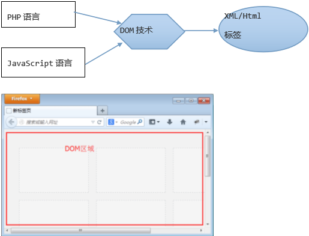

>author：MierX

>github：[StudyPhp](https://github.com/MierX/StudyPhp)

>create：21.4.16 17:31

>motto ：有志者，事竟成
---
#   01
    学习第一天的知识
##  JS高级 - 介绍
    JS定义：
        基于事件和对象驱动，并具有安全性能的脚本语言
        该语言运行在客户端浏览器里边，也有运行在服务器端的名称为“node.js”


##  JS高级 - 基本语法规范
    在html代码里引入js语言
        <script type="text/javascript">具体js代码</script>
        <script type="text/javascript" src="js文件"></script>
    代码大小写敏感
        true/false 布尔值
        TRUE/FALSE 非布尔值
        php语言大小写敏感（函数名、类名、类方法名称不敏感）
    结束符号
        每个简单语句使用';'分号结束，与php类似
        在javascript里面，分号不是必须的，但建议使用
    注释
        // 单行注释
        /* 多行注释 */
    变量
        其值可以发生改变的量就是变量
        变量是内存中运行的最小单位
        变量命名规则：字母、数字、下划线、$符号、汉字，数字不能作为变量名的开头
    数据类型
        number（int/float）、string、boolean、null、undefined、object（数组是对象的一部分）
    typeof判断变量的数据类型
##  JS高级 - number数值数据类型
    各种进制数表示
        十进制：var age = 23
        八进制：var score = 023
        十六进制：var color = 0x23
    浮点数
        带小数点的数
    最大数、最小数
        最大：Number.MAX_VALUE
        最小：Number.MIN_VALUE
    无穷大的数
        infinity
##  JS高级 - 算数和比较运算符
    算数运算符
        +（加）、-（减）、*（乘）、/（除）、%（取余、模）、++（自加1、自增1）、--（自减1）
        注意：++i、i++在赋值的情况下是有区别的
    比较运算符
        >（大于）、<（小于）、>=（大于等于）、<=（小于等于）、!=（值不等于）、==（值等于）、===（值、类型全等于）、!==（值、类型全不等于）
##  JS高级 - 逻辑运算符
    逻辑与
        &&：两边结果都为真，结果为真
    逻辑或
        ||：两边结果只有有一个为真，结果为真
    逻辑取非
        !：真即假，假即真
    注意点：
        逻辑运算符最终结果：
            在php里面，最终结果是布尔类型的值
            在js里面，&&和||的结果是其中一个操作数（最终影响结果的那个操作数），!是布尔结果
        短路运算：
            前一个操作数已经可以决定最终结果，后边的操作数就不会执行，其被短路
            只给执行一个操作数，不执行另一个操作数，不被执行的操作数就被短路
        加号运算符：
            两个意思：
                算数加法运算符（两边操作数都需要为是Number数值类型）
                字符串连接运算符（只要有一个操作数为字符串类型就做连接运算）


##  JS高级 - 流程控制（switch和break-continue）
```javascript
switch (变量) {
    case 常量:
        分支;
        break;
    case 常量:
        分支;
        break;
    case 常量:
        分支;
        break;
    default:
        分支;
        break;
}
switch (变量) {
    case 条件判断表达式:
        分支;
        break;
    case 条件判断表达式:
        分支;
        break;
    case 条件判断表达式:
        分支;
        break;
    default:
        分支;
        break;
}
```
    break：在循环、switch中使用，结束当前的本层循环，跳出switch的分支结构
    continue：在循环里面使用，跳出本次循环，进入下次循环
    通过标志位设置，可以使得break和continue的作用效果发生改变：
        for1
            flag:
            for2
             cat:
             for3
                break flag; // 把flag标志的循环结束


##  JS高级 - 函数的两种声明方式
    什么是函数：有一定功能的代码体的集合
    函数的封装：
        传统方式：
            function 函数名(){}
            函数先调用、后声明的条件是：全部代码在同一个<script></script>标记里面
        变量赋值方式声明函数（匿名函数使用）
            var 函数名 = function(){}
            在javascript里面，函数就是一个变量，数据类型是对象
            该方式没有“预加载”，必须（先声明，后调用）

##  JS高级 - 实参与形参的对应关系
    function 函数名(name, age, city = 'beijing'){}
    函数名('tom', 23, 'guangzhou'); // 传递实参信息


##  JS高级 - arguments关键字灵活接收实参
    function  函数名(){}  //函数声明没有形参
    函数名(实参，实参);  //调用的时候有传递实参
    利用arguments可以在函数里边接收实参信息。

##  JS高级 - callee关键字降低代码耦合度
    callee关键字：在函数内部使用，代表当前函数的引用（名字），可以降低代码的耦合度
    耦合度：一处代码的修改会导致其他代码也要发生改变(耦合度高)
    function f1(){
        arguments.callee();   //调用本函数（或者f1()）
    }
    f1();
##  JS高级 - return返回值
    function 函数名称(){
        函数执行体代码...
        return  信息;
    }
    console.log(函数名称()); //可以输出函数的return信息
    var rst = 函数名称(); //可以使得return信息对变量进行赋值
    
    一个函数执行完毕可以通过return关键字返回一定的信息，该信息可以直接输出，也可以进行变量赋值
    return本身还有结束函数执行的效果
    在一定意义上看，全部的数据类型（数值、字符串、布尔、对象、null）信息都可以用返回（undefined类型无需返回，本身无意义）
    在js中，return除了可以返回基本类型的信息，还可以返回function函数
    在js中，一切都是对象
    在一个函数内部，可以声明数值、字符串、布尔、对象等局部变量信息，言外之意就还可以声明函数（函数内部嵌套函数）变量信息，因为函数是对象，并且函数可以被return给返回出来


##  JS高级 - 匿名函数自调用

##  JS高级 - 全局和局部变量
    全局变量：
        php：
            函数外部声明的变量
            在函数内部也可以声明全局变量（函数调用之后起作用）
        js：
            在函数外部声明的变量
            在函数内部不使用“var”声明的变量（函数调用之后起作用）
    局部变量：
        php：在函数内部声明的变量
        js：在函数内部用“var”关键字声明的变量


##  JS高级 - 三种方式声明数组
    三种方式：
        ①：var arr = [元素, 元素, 元素, 元素, ...];
        ②：var arr = new Array(元素, 元素, 元素, 元素, ...);
        ③：var arr = new Array();
            arr[0] = 元素;
            arr[1] = 元素;
            arr[2] = 元素;
            ......
        注意：
            js数组的下标都是数字
            前两种方式声明的数组各个元素不能手动设置下标
            第三种方式可以给数组逐一设置下标
                数字下标就是数组部分
                字符串下标就是对象的成员属性
            js的数组本身是一个对象，内部有数组元素部分也有对象成员部分

##  JS高级 - 数组长度（遍历常用方法）
    arr.length; // 获得数组元素个数和
    数组遍历：
        沿着一定的顺序对数组内部的元素做一次且仅做一次访问，称作遍历
            for循环遍历：适合遍历下标是规则连续的数组
            for-in遍历：对下标没有具体要求，可以遍历数组、对象


##  JS高级 - 字符串调用成员原理
    通过(单/双)引号把键盘上用于显示的一些信息给括起来，就是一个字符串

##  JS高级 - eval语法结构使用
    eval(字符串)：
        该eval可以把内部参数字符串当成表达式，在上下文环境中运行
        该eval经常用于把其他用户传递过来的字符串信息转变为js的实体（对象、数组）信息

#   02
    学习第二天的知识
##  JS高级 - 昨天内容回顾
    TODO
##  JS高级 - DOM介绍
    dom：document object model（文档对象模型）
    DOM技术：
        php：php与xml/html标签之间沟通的一个桥梁
        js：js与xml/html标签之间沟通的一个桥梁
    作用：DOM可以让我们通过js对HTML文档进行增删改查的操作
    为了方便js通过DOM操作html文档比较方便，把html文档的各个组成内容划分为各种节点（对象）：
        文档节点（document）：html根节点的父节点
        元素节点
        文本节点
        属性节点
        注释节点


##  JS高级 - DOM获取元素节点对象
    方法：
        document.getElementById(id属性值)：每次只返回一个具体元素节点对象
        document.getElementsByTagName(tag标签名称)：每次返回一个集合列表对象，可以通过下标方式获取具体元素对象
        document.getElementsByName(name属性值)：该方法不推荐使用，有浏览器兼容问题

##  JS高级 - DOM获取文本节点对象
    获取文本节点首先获得元素节点对象，再通过元素节点对象获得其内部的文本节点
    元素节点.firstChild：获得元素节点内部的第一个子节点
    文本节点.nodeValue：获得文本节点对应的文本信息

##  JS高级 - DOM子节点和兄弟节点获取
    firstChild、lastChild:父节点获得第一个/最后一个子节点
    nextSibling:获得下一个兄弟节点
    previousSibling:获得上一个兄弟节点
    childNodes:父节点获得内部全部的子节点信息
    length: 获得“集合列表”的长度
    以上属性在主流浏览器(火狐firefox、chrome、safari、opera、IE9以上)中会给考虑空白节点(回车、空格)。在IE(6/7/8)浏览器中不考虑空白节点。
    空白节点本质：其是文本节点


##  JS高级 - DOM属性值和属性节点操作
    属性值操作：
        获取属性值：
            元素节点node.属性名称; //只能操作w3c规定的属性
            元素节点node.getAttribute(属性名称); //规定的 和 自定义的属性都可以获取
        修改属性值：
            元素节点node.属性名称 = 值; //只能操作w3c规定的属性
            元素节点node.setAttribute(名称，值); //规定的 和 自定义的属性都可以设置


##  JS高级 - DOM节点创建和追加操作
    节点创建：
        元素节点：document.createElement(tag标签名称)
        元素节点：document.createTextNode(文本内容)
        属性设置：node.setAttribute(名称, 值)
    节点追加：
        父节点.appendChild(子节点)
        父节点.insertBefore(newnode, oldnode)：把newnode放到oldnode前边
        父节点.replaceChild(newnode, oldnode)：把oldnode替换为newnode


##  JS高级 - DOM节点复制和删除
    节点复制：
        被复制节点.cloneNode(true/false)：
            true：深层复制（本身节点和其内部节点）
            flase：浅层复制（本身节点）
    节点删除：
        父节点.removeChild(子节点)
        子节点.parentNode.removeChild(子节点)


##  JS高级 - DOMcss样式的获取和设置
    <div style=”width:300px;height:200px; background-color:pink;”></div>
    获取css样式：元素节点.style.css样式名称
    设置（修改）css样式：元素节点.style.css央视名称 = 值
    注意：
        dom操作与css样式只能操作“行内样式”（css样式分为行内、内部、外部）
        操作复合样式（background-color/border-left-color）需要将中间的横线去掉后边的首字母大写
        修改样式，有则修改，无则新增，修改后的样式会变为行内样式

##  JS高级 - DOM2级事件设置
    事件：
        通过鼠标、键盘对浏览器页面所作的动作就是事件；
        事件一旦发生需要有事件处理，该处理称为“事件驱动”，事件驱动通常由js函数担任
        事件触发：
            onclick：鼠标点击
            onmouseover：鼠标移入
            onkeyup：键盘按下并抬起
            onkeydown：键盘按下
            onchange：内容改变
            onblur：失去焦点
            onfocus：获得焦点
            onsubmit：表单提交
    设置事件：
        dom一级方式设置：
            ①：
                <input  type=”text”  onclick=”函数名称()” />
            	function 函数名称(){this[window]}
            ②：
                <input  type=”text” onclick=”过程代码this[itnode]” />
            ③：
                itnode.onclick = function(){this[itnode]}  // 匿名函数
            ④：
                itnode.onclick = 函数名称; // 有名函数
                function 函数名称(){this[itnode]}
            取消dom一级事件：itnode.onlick = null
            以上是dom1级事件设置的4种具体表现形式，this关键字除了第①种其代表window对象，其他三种都代表事件节点对象本身。
        dom二级方式设置：
            主流浏览器方式（包括IE9以上）：
                设置：itnode.addEventListener(事件类型, 事件处理[, 事件流])
                取消：itnode.removeEventListener(事件类型, 事件处理[, 事件流])
            IE浏览器方式（IE6/7/8）：
                设置：itnode.attachEvent(事件类型, 事件处理)
                取消：itnode.detachEvent(事件类型, 事件处理)
            事件类型：
                就是我们可以设置的具体事件（onclik/onmouseover等）
                主流浏览器方式没有“on”标志，例如addEventListener('click', ...)
                IE浏览器没有“on”标志
            事件驱动：事件驱动是一个有名（匿名）函数
            事件流：
                true：捕捉型
                false：冒泡型
            dom二级事件设置的特点：
                可以为同一个对象设置多个同类型事件
                事件取消也非常灵活
                对事件流也有很好的处理控制
##  JS高级 - DOM2级事件取消操作
    事件取消操作具体要求：
        事件处理必须是有名函数，不可以是匿名函数
        事件取消的参数与绑定的参数完全一致


##  JS高级 - 事件流操作
    事件流：多个彼此嵌套元素，他们用有相同的事件，最内部元素事件被触发后，外部多个元素的同类型事件也会被触发
    事件流类型：
        冒泡型：时间从内部往外部依次执行
        捕捉型：事件从外部从内部依次执行


##  JS高级 - 获取事件对象
    事件对象，每个事件（包括鼠标、键盘事件）触发执行的过程中，都有对应的事件对象，通过事件对象可以获得鼠标相对于页面的坐标信息，也可以感知键盘哪个键子被触发，通过事件对象还可以阻止事件流产生、阻止浏览器默认动作
    获得事件对象：
        主流浏览器（IE9以上版本浏览器）：
            事件处理函数的第一个形参就是事件对象
##  JS高级 - 事件对象作用（获得鼠标坐标、阻止事件流、感知触发的键子）
##  JS高级 - 事件对象作用（组织浏览器默认动作）
##  JS高级 - 加载时间onload
##  JS高级 - BOM浏览器对象模型（显示时钟）
#   03
    学习第三天的知识
##  JS高级 - 昨天内容回顾
##  JS高级 - 昨天作业总结
##  JS高级 - 什么是作用域链
##  JS高级 - 作用域链的三个作用
##  JS高级 - 作用域链的作用
##  JS高级 - AO活动对象
##  JS高级 - 变量类型及优先级
##  JS高级 - 重新认识全局变量和局部变量
##  JS高级 - 闭包特点及原理
##  JS高级 - 闭包使用规则
##  JS高级 - 闭包案例（创建数组元素）
##  JS高级 - 闭包案例（事件操作）
##  JS高级 - 面向对象介绍
##  JS高级 - 三种方式创建对象
##  JS高级 - 对象在内存的分配
##  JS高级 - 对象调用其他函数或方法
##  JS高级 - call和apply使得函数执行
##  JS高级 - this的代表、构造器、return的影响
#   04
    学习第四天的知识
##  JS高级 - 昨天内容回顾
##  JS高级 - 昨天作业总结
##  JS高级 - 封装性（私有成员）
##  JS高级 - 原型继承具体实现
##  JS高级 - 原型继承注意
##  JS高级 - 对象访问成员类型及优先级
##  JS高级 - 原型链
##  JS高级 - 遍历对象及成员属组判断
##  JS高级 - 复制继承
##  JS高级 - 静态成员
##  JS高级 - 异常
##  JS高级 - 多态
##  JS高级 - 正则的介绍及简单使用
##  JS高级 - 正则的定义字符集组成
##  JS高级 - 正则的特别字符集组成1
##  JS高级 - 正则的特别字符集组成2
##  JS高级 - 正则的特别字符集组成（小括号使用）
##  JS高级 - 正则的模式修正符
#   05
    学习第五天的知识
##  JS高级 - 昨天内容回顾
##  JS高级 - 昨天作业总结
##  JS高级 - 小括号模式单元重复使用
##  JS高级 - 组合和限制字符
##  JS高级 - 正向（反向）预查
##  JS高级 - 正则案例（验证ip、邮箱、表单域邮箱信息）
##  JS高级 - 贪吃蛇：绘制地图
##  JS高级 - 贪吃蛇：绘制食物
##  JS高级 - 贪吃蛇：绘制小蛇
##  JS高级 - 贪吃蛇：移动小蛇
##  JS高级 - 贪吃蛇：控制小蛇方向
##  JS高级 - 贪吃蛇：吃食物增加蛇节、生成新食物
##  JS高级 - 贪吃蛇：控制小蛇的移动范围