>author：MierX

>github：[StudyPhp](https://github.com/MierX/StudyPhp)

>create：21.6.1 14:06

>motto ：有志者，事竟成
---
#   01
    学习第一天的知识
##  Ajax - 介绍
    Ajax：
        asynchronous javascript and xml（异步JavaScript和xml）
        其是可以与服务器进行（异部/同步）交互的技术之一
        ajax的语言载体是js
        其是浏览器的一个技术
        特点：页面不刷新（用户体验非常好）
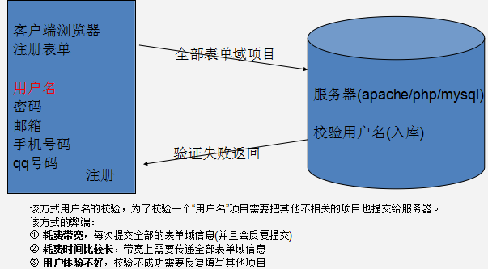
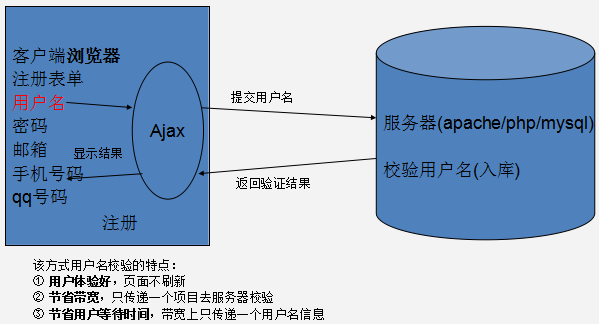
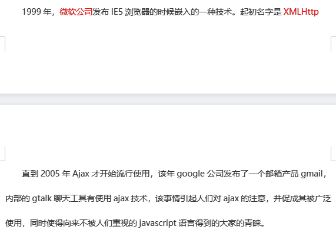
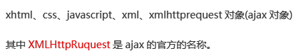
##  Ajax - 创建对象
    创建Ajax对象：
        主流浏览器方式：var xhr = new XMLHttpRequest()
        IE（6/7/8）方式：
            var xhr = new ActiveXObject("Microsoft.XMLHTTP")：最原始的方式
            var xhr = new ActiveXObject("Msxml2.XMLHTTP")：升级
            var xhr = new ActiveXObject("Msxml2.XMLHTTP.3.0")：升级
            var xhr = new ActiveXObject("Msxml2.XMLHTTP.5.0")：升级
            var xhr = new ActiveXObject("Msxml2.XMLHTTP.6.0")：IE维护的最高版本
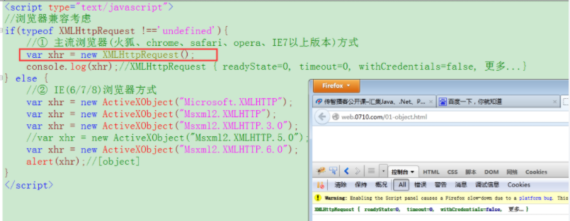
##  Ajax - 发起对服务器端的请求
    TODO
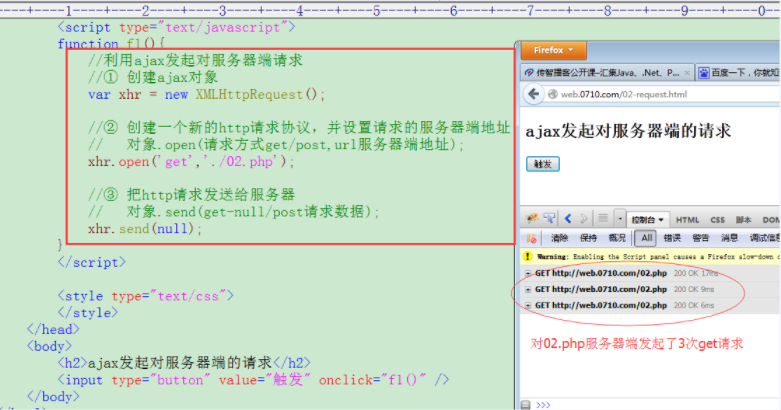
##  Ajax - 接收服务器端返回信息
    ajax可以接收什么信息？
        浏览器可以接收的信息ajax都可以接收，例如字符串、html标签、css样式内容、xml内容、json内容等
    ajax接收返回的信息，需要结合readyState/onreadystatechange/responseText等属性一并操作
    ajax对象常用的属性和方法：
        属性：
            responseText：以字符串形式接收服务器端返回的信息
            readyState（ajax对象状态）：
                0：创建ajax对象
                1：有调用open方法
                2：有调用send方法
                3：只返回一部分数据
                4：数据返回完整
            onreadystatechange：
                是ajax的“事件”，在readyState状态发生变化的时候被触发，为了感知最多的状态信息，要设置在对象创建完毕之后
        方法：
            open(请求方式, 地址)：创建新的http协议
            send(请求数据)：发送请求
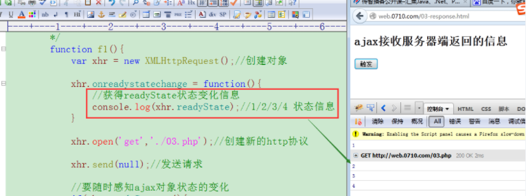
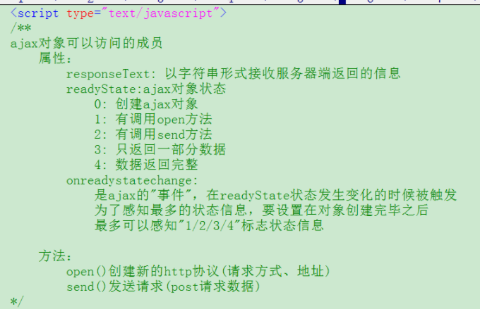
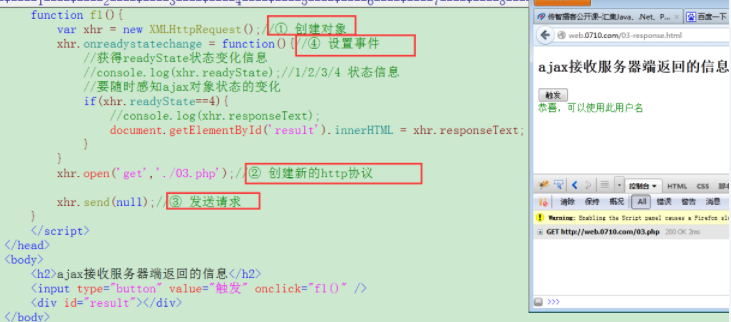
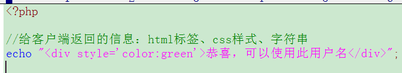
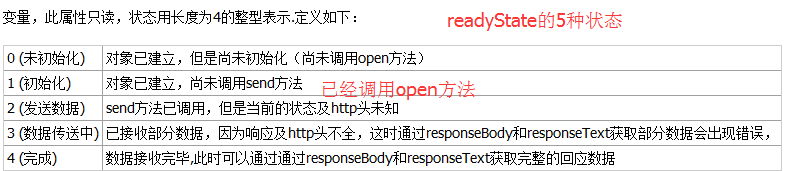
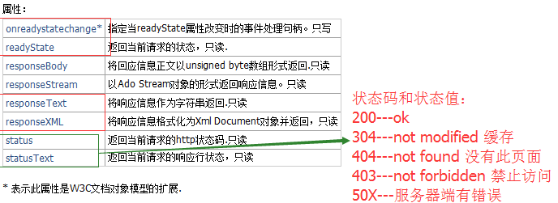
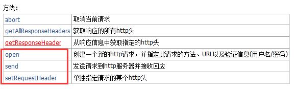
##  Ajax - get方式请求细节
    get与post两者的不同：
        给服务器传递的数据量：
            get方式的大小是受限于浏览器，大部分浏览器是2k的限制（chrome就是8k，1024字节是1k）
            post原则上没有限制，php.ini对其限制为8M
        安全方面：post传递数据相对安全
        传递数据的形式不一样：
            get方式在url地址后便以请求字符串形式传递参数
            post方式是把form表单的数据给请求出来以xml形式传递给服务器
    ajax之get方式请求：
        注意：
            在url地址后边以请求字符串形式传递数据
            对中文、=、&等特殊符号需要编码处理
        对特殊信息的处理：
            在浏览器通过get参数传递一些特殊符号信息会被误解混淆，例如&、=等，浏览器会把这些信息当作get参数的一部分而进行一个错误的解析，为了避免这种情况放生，可以对该信息进行编码处理
            有的浏览器传递中文会出现不识别的问题，也可以进行编码处理
            编码后的信息是相对底层的信息，浏览器会自动识别，获取的时候无需反编码
            在php里边可以通过函数urlencode()/urldecode()对特殊符号进行编码、反编码处理
            在js里可以通过encodeURIComponent()对特殊符号等信息进行编码
            编码后的信息为%号后接两个十六进制数
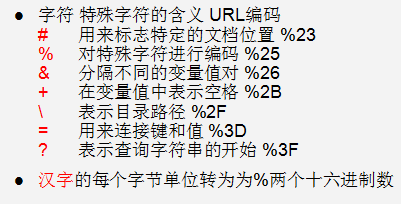
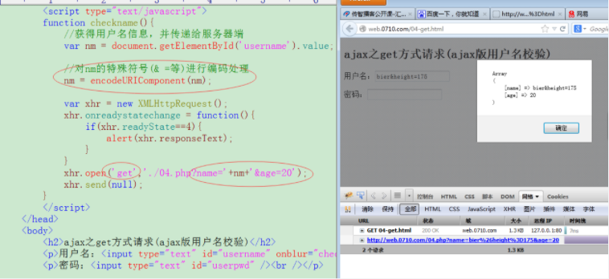
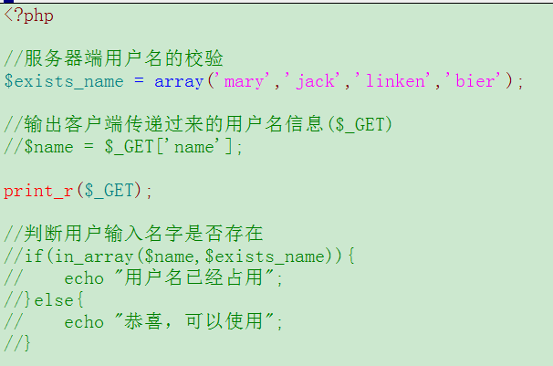
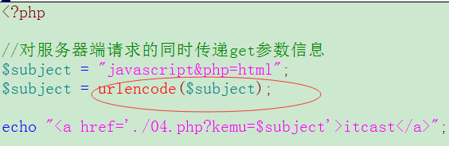
##  Ajax - post方式请求细节
    注意：
        给服务器传递数据需要调用send()方法
        调用方法setRequestHeader()把传递的数据组织为xml格式（模仿form表单传递数据）
        传递的中文信息无需编码，特殊符号像&、=等，仍需要编码
        该方式请求的同时也可以传递get参数信息，同样使用$_GET接收该信息
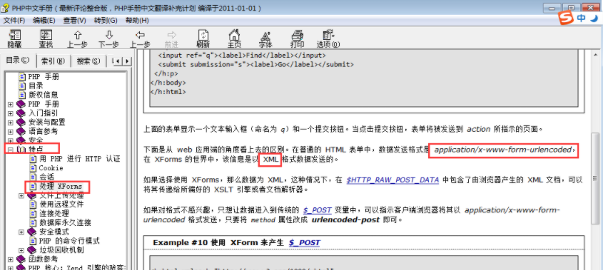
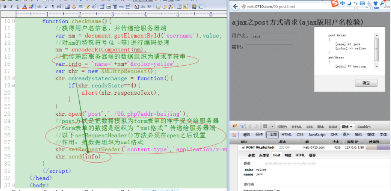
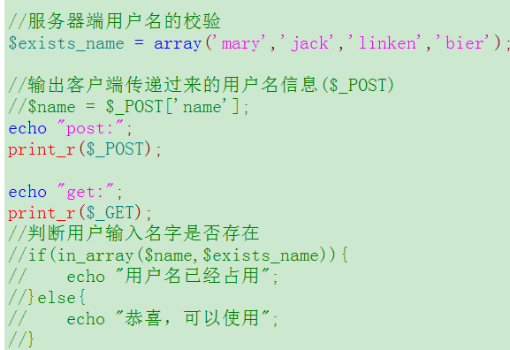
##  Ajax - 同步和异步请求
    ajax对象.open(请求方式, url地址, [异步true/同步false])：
        ajax是可以与服务器进行异步或同步交互的技术之一
        异步：同一个时间点允许执行进程
        同步：同一个时间点只允许执行一个进程
    什么情况下使用同步请求：
        ajax绝大多数情况下进行异步请求，但是有的时候也要使用“同步请求”（其不能被取代）
        例如页面有两部分内容：ajax请求内容和正常的html内容输出
        如果html的输出内容包括ajax请求的内容，就需要使得ajax请求完成了再进行html内容的输出，这样就要设置两者一前一后调用（而非同时调用）
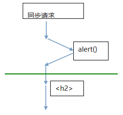
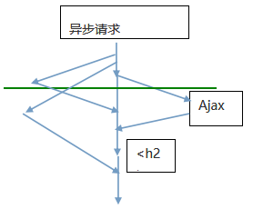
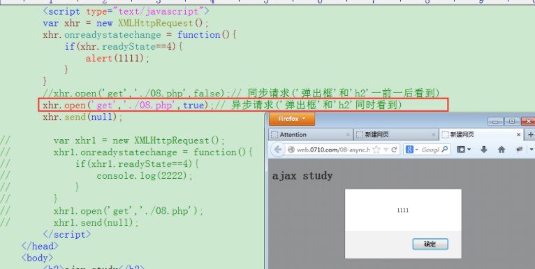
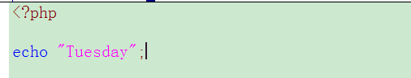
##  Ajax - 无刷新分页（分析必要性）
    无刷新分页的必要性：
        如果我们通过“传统方式”实现商品评论分页效果
        每次分页的时候就会使得头部、左侧、底部等已经显示的信息重新从服务器获得出来
        这样对带宽、服务器资源、用户等待时间都有额外的损耗
        如果使用ajax无刷新分页，每次就只从服务器获得“商品评论区域”信息即可
        对各方面资源的使用就有相应节省
        因此ajax无刷新分页效果有其存在必要性
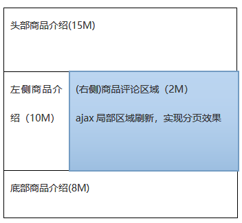
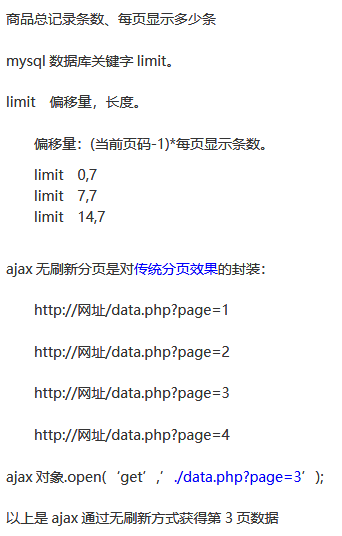
##  Ajax - 无刷新分页（传统分页效果制作）
    TODO
##  Ajax - 无刷新分页（ajax实现）
    TODO
##  Ajax - 对xml的接收和处理
    php可以接收处理xml信息
    js也可以接收处理xml信息
    ajax负责请求xml和接收xml信息，dom负责处理xml信息
    dom：
        php里边，dom是php与xml、html之间沟通的桥梁
        js里边，dom是js与html、xml沟通桥梁
##  Ajax - 对xml的接收和处理2
    TODO
##  Ajax - 对缓存处理
    缓存：
        浏览器的一次请求需要从服务器活的许多css、img、js等相关的文件
        如果每次请求都把相关的资源文件加载一次，对带宽、服务器资源、用户等待时间都有严重的个损耗
        浏览器有做优化处理，其把css、img、js等文件在第一次请求成功之后就在本地保留一个缓存备份
        后续的每次请求就在本身获得相关的缓存资源文件就可以了，可以明显地加快用户的访问速度
        css、img、js等文件可以缓存，但是动态程序文件如php文件不能缓存，即使缓存我们也不要其缓存效果
    浏览器对动态程序文件缓存的处理解决：
        给请求的地址设置随机数
        给动态程序设置header头信息，禁止浏览器对其缓存
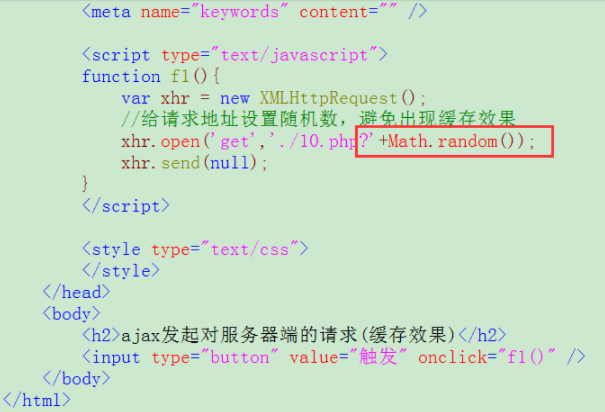
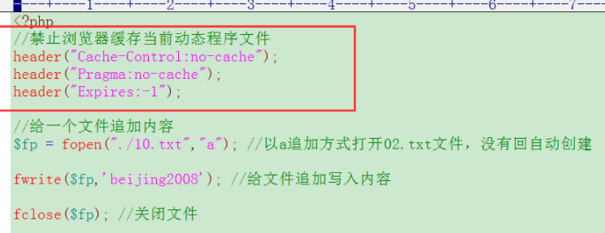
##  Ajax - tp框架使用ajax校验用户名
    TODO
#   02
    学习第二天的知识
##  Ajax - 回顾昨天内容
    TODO
##  Ajax - json介绍
    什么是JSON：
        JavaScript Object Notation（js对象符号）
    json在js里的使用：
        var obj = {名称:值, 名称:值, 名称:值, ...}：json在js里面就是字面量对象
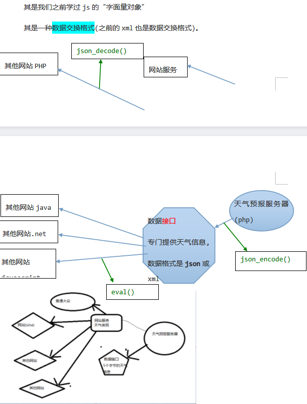
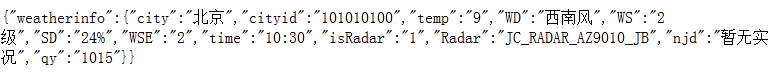
##  Ajax - php生成json信息
    json_encode(数组/对象)：生成json格式信息
    json_encode(关联数组)：生成json对象
    json_encode(索引数组)：生成js数组
    json_encode(索引关联数组)：生成json数组
    json_encode(对象)：生成json对象
    注意：json数据在php中的数据类型是字符串
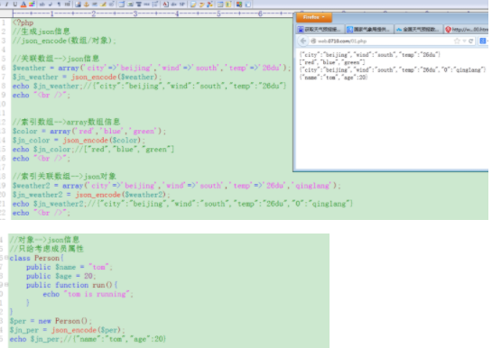
##  Ajax - php反编码json信息
    json_decode(json数据, true/false)：反编码json数据，对json字符串进行反编码，解析为php可以识别的信息
        true：默认转换成数组
        false：转换成对象
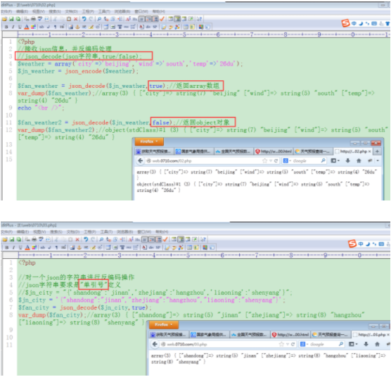
##  Ajax - javascript对json信息的接收处理
    ajax获得接口信息，js处理json数据，通过eval()把接收的json字符串变成真实的对象信息
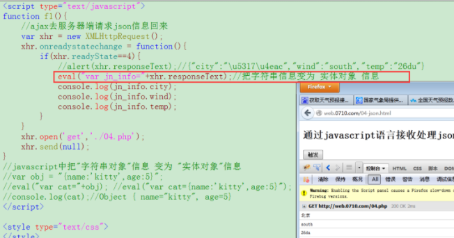
##  Ajax - json改造无刷新分页
    TODO
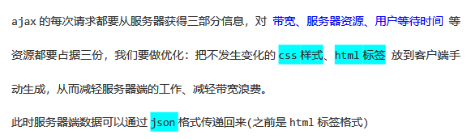
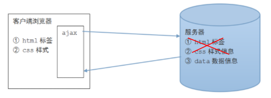
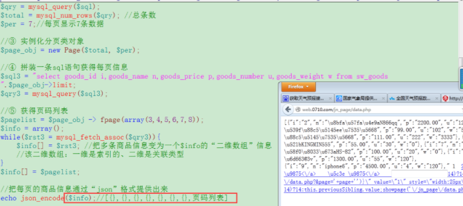
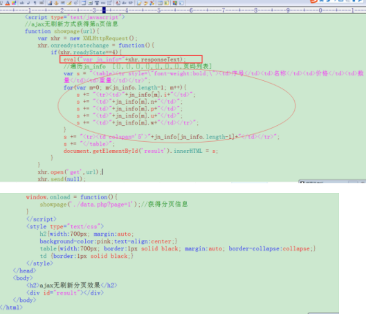
##  Ajax - FormData快速收集表单信息和无刷新提交
    收集表单信息：
        利用新技术FormData表单数据对象，可以实现快速收集表单信息
        FormData是html5的新技术，在主流浏览器都可以正常使用
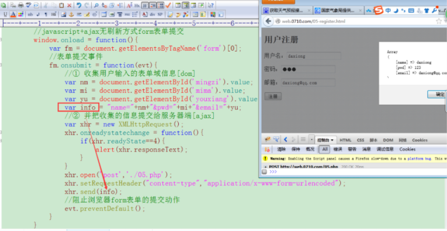
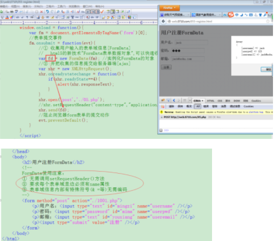
##  Ajax - FormData和ajax实现无刷新方式上传附件
    表单上传附件语法：
        前端发送：
            <form  enctype=”multipart/form-data”>
                <input  type=”file”>
            </form>
        后端接收：
            $_FILES：接收附件信息(name/error/size/type/tmp_name)
                error：
                    0：ok
                    1：大小超出php.ini限制
                    2：大小超出MAX_FILE_SIZE表单域限制
                    3：附件只上传了一部分
                    4：没有上传附件
            move_uploaded_file(附件临时路径名, 真实附件路径名)：保存附件
    收集附件信息：
        dom方式只可以收集普通的表单域信息，并且浏览器由于安全方面的限制也禁止通过JS语言操作本地文件
        可以利用FormData实现附件信息的收集：普通表单域和上传文件域都可以收集
    使用FormData注意：
        每个表单域必须有name属性
        在
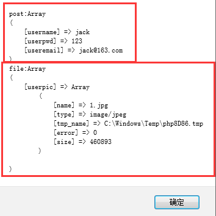
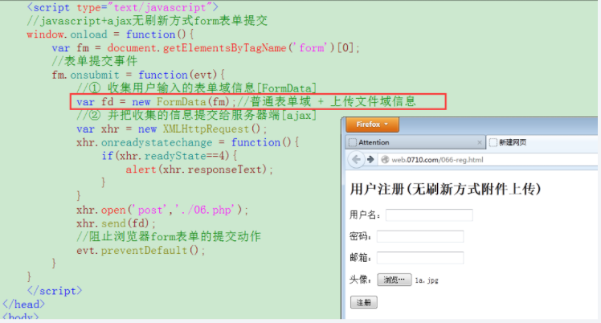
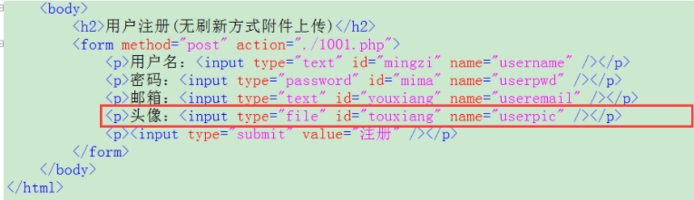
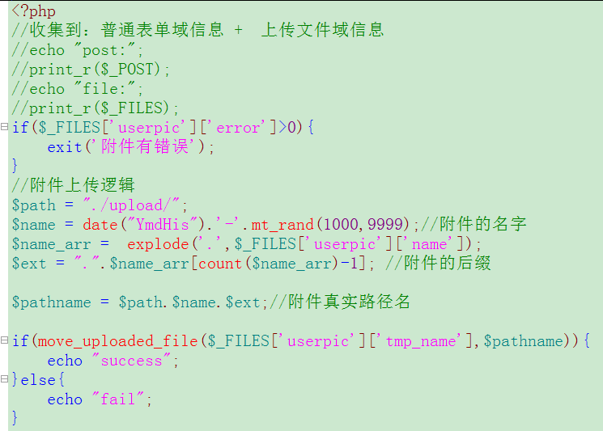

##  Ajax - 大附件上传进度条设置
    
##  Ajax - 聊天室（分析）
##  Ajax - 聊天室（即时显示最新聊天内容）
##  Ajax - 聊天室（发表聊天信息及聊天室两个优化）
##  Ajax - 显示天气预报原理及现成接口使用