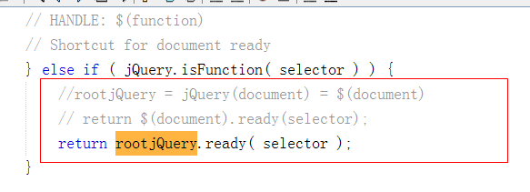
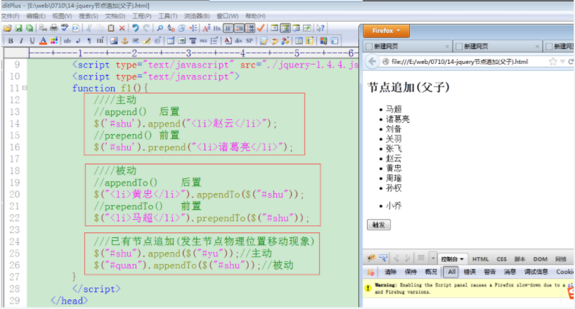

>author：MierX

>github：[StudyPhp](https://github.com/MierX/StudyPhp)

>create：21.6.7 15:49

>motto ：有志者，事竟成
---
#   01
    学习第一天的知识
##  jQuery - 昨天内容回顾
    TODO
##  jQuery - 介绍及简单使用
    什么是jQuery：
        其是对js封装的一个框架包，简化对js的操作
        区别：
            js代码：dom获得页面节点对象、ajax操作、事件操作、事件对象
            jq代码：无需考虑浏览器兼容问题、代码非常少
    官网：http://jquery.com
    宗旨和特点：
        宗旨：用更少的代码实现更多的的功能
        特点：
            语法简练、语义易懂、学习快速、文档丰富
            jQuery是一个轻量级脚本，其代码非常小巧
            jQuery支持css1-css3定义的属性和选择器
            jQuery是跨浏览器的，它支持的浏览器包括IE6.0+、FF1.5+、Safari2.0+和Opera9.0+
            能将JavaScript（行为）脚本与HTML（结构）源代码完全分离，便于后期编辑和维护
            插件丰富，除了jQuery自身带有的一些特效外，可以通过插件实现更多功能

##  jQuery - 基本选择器
    在页面上获得的各种元素节点对象而使用的条件就是选择器：
        document.getElementById()
        document.getElementByTagName()
        document.getElementByName()
    基本选择器：
        $('#id值')：等价于document.getElementById()
        $('标签名称')：等价于document.getElementByTagName()
        $('.class名称')：class属性值选择器
        $('*')：通配符选择器
        $('s1,s2,s3')：联合选择器

##  jQuery - 层次选择器
    层次选择器：
        $(s1 s2)：派生选择器，父子关系，在s1内部获得全部的s2节点（不考虑层次）
            $(“div  span”):
                

                    ****
                    

                        ****
                    

                

            
        $(s1>s2)：直接子元素选择器，父子关系，在s1内部获得子元素（次级）节点s2
            $(“div > span”):
            

                ****
                

                    
                

                ****
            

            
        $(s1+s2)：直接兄弟选择器，兄弟关系，在s1后边获得紧挨着的同层级的第一个兄弟关系的s2节点
            $(“div + span”):
            

                
                

                    
                

                
            

            ****
            

            
        $(s1~s2)：后续全部兄弟关系节点选择器：在s1后边获得全部同层级的兄弟关系的s2节点
            $(“div ~ span”):
            

                
                

                
                

                
            

            ****
            

            ****

##  jQuery - 并且选择器（基本使用）
    TODO

##  jQuery - 并且选择器（复杂使用）
    复杂用法：
        注意：
            并且选择器可以单独使用
            各种选择器都可以构成“并且”关系
            并且关系的选择器可以使用多个，每个选择器使用前，已经获得节点的下标要“归位（归零）”处理
            多个并且关系的选择器，没有前后顺序要求，但是要避免产生“歧义”

##  jQuery - 内容过滤选择器
    :contains(内容)：包含内容选择器，获得内部必须包含指定内容的节点
        $(“div:contains(beijing)”)
        **
**
            **xiaoming like**
            **beijing**
        **
**
        
mary like newyork

    :empty：获得的空元素（内部没有任何元素节点/文本）的节点对象
        $(“div:empty”)
        
xiaoming like beijing

        
mary like newyork

        

        
     

        **

**
    :has(选择器)：节点内部必须包含指定选择器对应的元素
        $(‘div:has(.apple)’)
        

        **

**
    :parent：寻找的节点必须作为父元素节点存在
        $(‘div:parent’)
        **
xiaoming like beijing
**
        **
mary like newyork
**
        **

**
        **
     
**
        

##  jQuery - 表单域选中选择器
    $(:checked)：复选框、单选按钮选中选择器
    $(:selected)：下拉列表选中选择器

##  jQuery - 属性操作
    dom方式操作属性值：
        获取：
            itnode.属性名称
            itnode.getAttribute(属性名称)
        修改：
            itnode.属性名称 = 值
            itnode.setAttribute(属性名称, 值)
    jQuery方式操作属性值：
        $().attr(属性名称)：获得属性信息值
        $().attr(属性名称, 值)：设置（修改）属性信息值
        $().removeAttr(属性名称)：删除属性信息值
        $().attr(json对象)：同时为多个属性设置信息值，json对象的键值就是名称和值
        $().attr(属性名称, fn)：通过fn函数执行的return返回值对属性进行赋值

##  jQuery - class属性快捷操作
    class属性值操作：
        $().attr('class', 值)：修改class属性
        $().attr('class')：获取class属性
        $().removeAttr(class属性值)：删除class的属性值
    class具体快捷操作方法：
        $().addClass(class属性值)：给class属性追加信息值
        $().removeClass(class属性值)：删除class属性中的某个信息值
        $().toggleClass(class属性值)：开关效果，有就删除，没有就添加

##  jQuery - 标签包含内容操作
    js操作：
        divnode.innerHTML：获得div包含的信息
        divnode.innerHTML = XXX：设置div内包含的信息
        （innerHTML不是w3c标准技术）
    jq操作：
        $().html()：获得节点包含的信息
        $().html(XXX)：设置节点包含的信息
        $().text()：获得节点包含的“文本字符串”信息
        $().text(XXX)：设置节点包含的信息（有html标签就会把标记符号变为实体）
    html()和text()方法的区别：
        获取内容：
            前者可以获取html标签和普通字符串内容
            后者只获取普通字符串内容（会自动过滤html标签）
        设置内容：
            前者可以设置html标签和普通字符串的内容
            后者只设置普通字符串内容，如果内容里面有tag标签内容，就把其中"<"、">"符号转变为实体符号“&lt;”、“&gt”
        以上两种操作（获取/设置）如果针对的操作内容是纯字符串内容，则使用效果一致

##  jQuery - css样式操作
    $().css(name, value)：设置css
    $().css(name)：获取css属性值
    $().css(json对象)：同时修改多个css样式
    css()样式操作特点：
        样式获取：
            jq可以获取行内、内部、外部样式
            dom只可以获取行内样式
        获取复合属性样式，需要拆分为“具体样式”才可以操作（部分浏览器不需要）
        样式的设置，会被设置为“行内样式”

##  jQuery - 复选框操作（获取）
    value属性值操作：
        $().attr('value')：获取value值
        $().attr('value', 信息值)：设置value值
    value属性值快捷操作：
        $().val()：获得value属性值
        $().val(信息值)：设置value属性值
        该val()方法在复选框、单选按钮、下拉列表的使用有卓越表现
    复选框操作：
        获得被选中复选框的value属性值
        设置默认情况下哪个复选框被选中

##  jQuery - 复选框操作（设置选中项目）
    TODO

##  jQuery - 下拉列表和单选按钮的获取和设置操作
    TODO

##  jQuery - 复选框全选、全不选、反选操作
    $().attr('checked', true)：设置复选框选中
    $().attr('checked', false)：取消复选框选中
    $().attr('checked')：判断复选框选中情况，返回布尔值

#   02
    学习第二天的知识
##  jQuery - 昨天内容回顾
    TODO
##  jQuery - 昨天作业总结
    TODO
##  jQuery - $符号由来
    选择器使用的过程就是函数调用过程
     $符号就是一个函数，函数名称为“$”符号而已，也可以使用“jQuery”符号替代
     在jQeury框架外部使用的$符号本质是一个“函数”，除此之外还可以使用jQuery，它们都是同一个函数的不同名字，并且通过window声明的全局变量
 
##  jQuery - jQuery对象和dom对象的关系及转化
    jQuery对象封装DOM对象：DOM对象事jQuery对象的数组组成部分
    jQuery对象和DOM对象的转化：
        jQuery对象转化为DOM对象：$()['context']
        DOM对象转化为jQuery对象：$(dom对象)

##  jQuery - jQuery对象可调用成员分析
    jQuery框架对象类型：jQuery对象和$对象
    jQuery对象（普通对象）：就是各种选择器创建出来的对象，$('div')
    $对象（函数对象）：$.get()
    jQuery对象：
        $('#one') = $函数 = new jQuery.fn.init()
        $('#one').css()/attr()/addClass()/html()/text()等等，jquery对象可以调用许多成员
    jQuery对象可以调用的成员一共有三种:
        init本身成员
        fn的成员
        fn.extend复制继承过来的

##  jQuery - $对象分析
    $对象使用例如：$.get(url请求地址)：ajax请求
    $本身就是函数，函数也是对象
    在javascript里边可以给函数声明成员(称为”静态成员”)

##  jQuery - each遍历方法
    $.each(数组/对象, function (key, value) {})：$对象调用的
    $(选择器).each(function (key, value) {})：jQuery对象调用的

##  jQuery - 三种加载事件体现
    加载事件的作用：使得html和css代码先执行，最后执行JavaScript代码
    JavaScript加载事件：
        <body onload="函数"></body>
        window.onload = function(){}
    jQuery加载事件：
        $(document).ready(function(){})：$(document)是把document的DOM对象变为jQuery对象
        $().ready(function(){})：$()也是创建jQuery对象，不过内部没有DOM对象的组成部分
        $(function(){})：对第一种加载的封装，简写

##  jQuery - 加载事件（jQuery和传统的区别）
    设置个数：
        在同一个请求里，jQuery加载事件可以设置多个，而传统方式只能设置一个
        传统方式加载事件是给onload事件属性赋值，多次赋值，后者会覆盖前者
        jQuery方式加载事件是把每个加载事件都存入一个数组里边并成为数组的元素，执行的时候就遍历数组执行每个元素即可
    执行时机不一样：
        传统方式加载事件是会等页面全部内容（文字、图片、样式）在浏览器显示（加载）完毕后再执行加载事件
        jQuery方式加载事件，只要页面全部内容在内存里对应的DOM树结构绘制完毕就会执行，有可能出现对应的内容还未在浏览器页面上显示

##  jQuery - jQuery加载事件原理
    TODO

##  jQuery - jQuery简单事件操作
    DOM一级事件设置：
        

        

        itnode.onclick = function(){}
        itnode.onclick = 函数名
    DOM二级事件设置：
        itnode.addEventListener(类型, 处理, 事件流)
        itnode.removeEventListener(类型, 处理, 事件流)
        node.attachEvent()
        node.detachEvent()
    jQuery事件设置（无需考虑浏览器兼容问题）：
        $(选择器).事件类型(事件处理函数fn)：设置事件
        $(选择器).事件类型()：触发事件执行
    jQuery事件类型：
        click
        keyup
        keydown
        mouseover
        mouseout
        blur
        focus
        ……

##  jQuery - 支挡操作（节点追加）
    父子关系追加：
        主动追加：
            $(选择器).append(追加内容)：向每个匹配的节点内部后置追加内容
            $(选择器).prepend(追加内容)：向每个匹配的节点内部前置追加内容
        被动追加：
            $(被追加内容).appendTo(选择器)：把所有匹配的节点后置追加到另一个指定的节点中
            $(被追加内容).prependTo(选择器)：把所有匹配的节点前置追加到另一个指定的节点中
    兄弟关系追加：
        主动追加：
            $(选择器).after(追加内容)：向每个匹配的节点之后插入追加内容
            $(选择器).before(追加内容)：向每个匹配的节点之前插入追加内容
        被动追加：
            $(被追加内容).insertAfter(选择器)：把所有匹配的节点插入到另一个指定的节点的后面
            $(被追加内容).insertBefore(选择器)：把所有匹配的节点插入到另一个指定的节点的前面

##  jQuery - 节点替换、删除、新增和删除节点案例效果
    节点替换：
        $(替换内容).replaceAll(被替换节点)：主动替换
        $(被替换节点).replaceWith(替换内容)：被动替换
    节点删除：
        $(父节点).empty()：清空父节点内部
        $(选择器).remove()：删除指定节点

##  jQuery - 节点复制操作
    节点复制：
        $(选择器).clone(true)：复制指定的节点和其属性（事件）
        $(选择器).clone(false)：只复制节点本身和节点内部信息（不包含属性）
        DOM的节点复制操作：
            node.cloneNode(true/false)：
                true：深层复制（本身和内部节点）
                false：浅层复制（本身）

##  jQuery - 属性选择器
    例：<input type=”text” name=”username” id=”username” class=”pear” addr=’beijing’ />
        $([name])：匹配必须有“name”属性存在的节点
        $([name=value])：匹配必须有“name”属性值等于“value”的节点
        $([name^=value])：匹配必须有“name”属性值以“value”开头的节点
        $([name$=value])：匹配必须有“name”属性值以“value”结尾的节点
        $([name*=value])：匹配必须有“name”属性值包含“value”的节点
        $([name!=value])：匹配必须有“name”属性值不等于“value”的节点（没有“name”属性也可以）
        $([name1][name2][name3]...)：多个属性选择器可以构成“并且”关系

#   03
    学习第三天的知识
##  jQuery - 昨天内容回顾
    TODO
##  jQuery - 昨天作业总结
    TODO
##  jQuery - 事件绑定的三种形式
##  jQuery - 取消事件绑定及事件对象和作用
##  jQuery - 基本和垂直动画效果
##  jQuery - 颜色渐变动画效果
##  jQuery - 对ajax的封装使用
##  jQuery - 地区三级联动（显示省份）
##  jQuery - 地区三级联动（显示城市）
##  jQuery - 迷你jQuery开发（制作选择器）
##  jQuery - 迷你jQuery开发（attr和css方法制作）
##  jQuery - 迷你jQuery开发（each方法制作）
##  jQuery - 插件开发使用