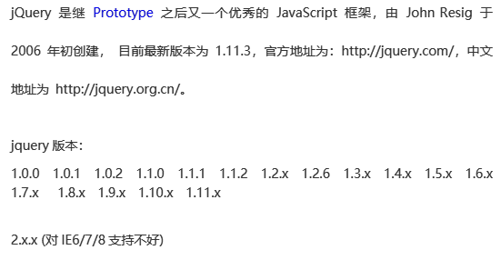

>author：MierX

>github：[StudyPhp](https://github.com/MierX/StudyPhp)

>create：21.6.7 15:49

>motto ：有志者，事竟成
---
#   01
    学习第一天的知识
##  jQuery - 昨天内容回顾
    TODO
##  jQuery - 介绍及简单使用
    什么是jQuery：
        其是对js封装的一个框架包，简化对js的操作
        区别：
            js代码：dom获得页面节点对象、ajax操作、事件操作、事件对象
            jq代码：无需考虑浏览器兼容问题、代码非常少
    官网：http://jquery.com
    宗旨和特点：
        宗旨：用更少的代码实现更多的的功能
        特点：
            语法简练、语义易懂、学习快速、文档丰富
            jQuery是一个轻量级脚本，其代码非常小巧
            jQuery支持css1-css3定义的属性和选择器
            jQuery是跨浏览器的，它支持的浏览器包括IE6.0+、FF1.5+、Safari2.0+和Opera9.0+
            能将JavaScript（行为）脚本与HTML（结构）源代码完全分离，便于后期编辑和维护
            插件丰富，除了jQuery自身带有的一些特效外，可以通过插件实现更多功能

##  jQuery - 基本选择器
    在页面上获得的各种元素节点对象而使用的条件就是选择器：
        document.getElementById()
        document.getElementByTagName()
        document.getElementByName()
    基本选择器：
        $('#id值')：等价于document.getElementById()
        $('标签名称')：等价于document.getElementByTagName()
        $('.class名称')：class属性值选择器
        $('*')：通配符选择器
        $('s1,s2,s3')：联合选择器

##  jQuery - 层次选择器
    层次选择器：
        $(s1 s2)：派生选择器，父子关系，在s1内部获得全部的s2节点（不考虑层次）
            $(“div  span”):
                

                    ****
                    

                        ****
                    

                

            
        $(s1>s2)：直接子元素选择器，父子关系，在s1内部获得子元素（次级）节点s2
            $(“div > span”):
            

                ****
                

                    
                

                ****
            

            
        $(s1+s2)：直接兄弟选择器，兄弟关系，在s1后边获得紧挨着的同层级的第一个兄弟关系的s2节点
            $(“div + span”):
            

                
                

                    
                

                
            

            ****
            

            
        $(s1~s2)：后续全部兄弟关系节点选择器：在s1后边获得全部同层级的兄弟关系的s2节点
            $(“div ~ span”):
            

                
                

                
                

                
            

            ****
            

            ****

##  jQuery - 并且选择器（基本使用）
    TODO

##  jQuery - 并且选择器（复杂使用）
    复杂用法：
        注意：
            并且选择器可以单独使用
            各种选择器都可以构成“并且”关系
            并且关系的选择器可以使用多个，每个选择器使用前，已经获得节点的下标要“归位（归零）”处理
            多个并且关系的选择器，没有前后顺序要求，但是要避免产生“歧义”

##  jQuery - 内容过滤选择器
    :contains(内容)：包含内容选择器，获得内部必须包含指定内容的节点
        $(“div:contains(beijing)”)
        **
**
            **xiaoming like**
            **beijing**
        **
**
        
mary like newyork

    :empty：获得的空元素（内部没有任何元素节点/文本）的节点对象
        $(“div:empty”)
        
xiaoming like beijing

        
mary like newyork

        

        
     

        **

**
    :has(选择器)：节点内部必须包含指定选择器对应的元素
        $(‘div:has(.apple)’)
        

        **

**
    :parent：寻找的节点必须作为父元素节点存在
        $(‘div:parent’)
        **
xiaoming like beijing
**
        **
mary like newyork
**
        **

**
        **
     
**
        

##  jQuery - 表单域选中选择器
##  jQuery - 属性操作
##  jQuery - class属性快捷操作
##  jQuery - 标签包含内容操作
##  jQuery - css样式操作
##  jQuery - 复选框操作（获取）
##  jQuery - 复选框操作（设置选中项目）
##  jQuery - 下拉列表和单选按钮的获取和设置操作
##  jQuery - 复选框全选、全不选、反选操作
#   02
    学习第二天的知识
##  jQuery - 昨天内容回顾
##  jQuery - 昨天作业总结
##  jQuery - $符号由来
##  jQuery - jQuery对象和dom对象的关系及转化
##  jQuery - jQuery对象可调用成员分析
##  jQuery - $对象分析
##  jQuery - each遍历方法
##  jQuery - 三种加载事件体现
##  jQuery - 加载事件（jQuery和传统的区别）
##  jQuery - jQuery加载事件原理
##  jQuery - jQuery简单事件操作
##  jQuery - 支挡操作（节点追加）
##  jQuery - 节点替换、删除、新增和删除节点案例效果
##  jQuery - 节点复制操作
##  jQuery - 属性选择器
#   03
    学习第三天的知识
##  jQuery - 昨天内容回顾
##  jQuery - 昨天作业总结
##  jQuery - 事件绑定的三种形式
##  jQuery - 取消事件绑定及事件对象和作用
##  jQuery - 基本和垂直动画效果
##  jQuery - 颜色渐变动画效果
##  jQuery - 对ajax的封装使用
##  jQuery - 地区三级联动（显示省份）
##  jQuery - 地区三级联动（显示城市）
##  jQuery - 迷你jQuery开发（制作选择器）
##  jQuery - 迷你jQuery开发（attr和css方法制作）
##  jQuery - 迷你jQuery开发（each方法制作）
##  jQuery - 插件开发使用