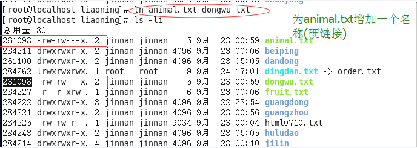
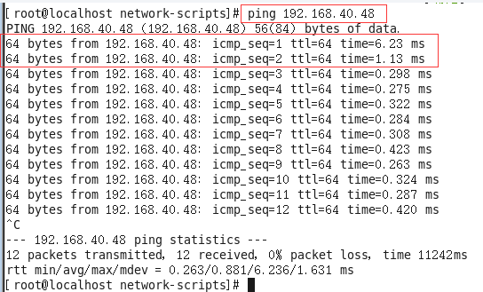
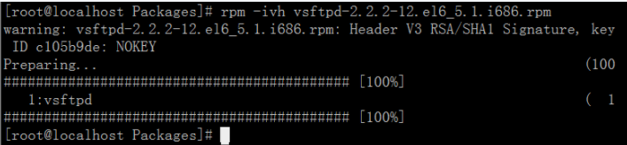
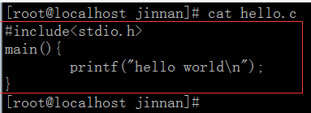
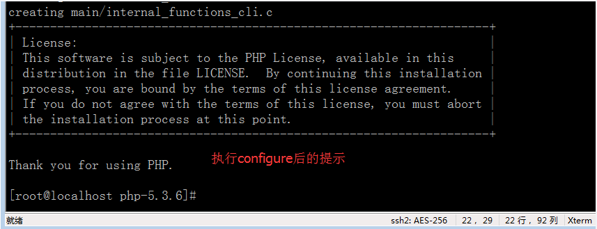

>author：MierX

>github：[StudyPhp](https://github.com/MierX/StudyPhp)

>create：21.6.10 17:44

>motto ：有志者，事竟成
---
#   01
    学习第一天的知识
##  Linux - 攒一个裸机电脑
    什么时候使用Linux操作系统？
        作为网站的服务器系统使用
        apache、php、mysql等服务软件需要安装在此系统里边
    Linux系统的特点：
        稳定、免费、网络功能丰富（apache、redis、memcache、邮箱、mysql等等）、安全
    VMware WorkStation 11安装教程：https://jingyan.baidu.com/article/f00622281118e9fbd3f0c8db.html

##  Linux - 安装操作系统
    创建好虚拟机后，开始安装CentOS 6.6 64位

##  Linux - 安装后的配置
    安装好系统后，开始配置CentOS 6.6系统的相关配置

##  Linux - 简单命令模式指令
    ls：查看目录下有什么文件
    ls 目录：查看指定目录下有什么文件
    ls -a：查看目录下全部文件（包括隐藏文件）
    ls -l：以详细列表形式查看目录下的文件
    ls -al：以详细列表形式查看目录下的全部文件
    cd 目录名称：目录切换
    pwd：获得当前操作的目录位置
    su -：切换到root用户
    su - root：切换到root用户
    su root：root用户切换，在部分linux系统中，用户是root但权限是普通的
    su 普通用户名：没有横线，切换到指定用户
    exit：退回到上一个用户
        注意：su和exit要配对使用，如果使用多个su，会造成用户叠加
    whoami：查看当前操作者信息
    # init 3：切换桌面模式
    # init 5：切换命令行模式

##  Linux - 系统分区原理
    win系统分区原理：类似一个倒着的森林
    linux系统分区原理：类似一个倒着的大树

##  Linux - 根目录文件介绍
    cd /：切换到根目录
    必须记住的目录：
        /dev：系统硬件设备目录
        /home：用户家目录
        /var：项目部署目录
        /etc：主要配置文件目录
        /usr：软件安装目录
    内核文件与发行版：
        linux操作系统是1991年芬兰赫尔辛基大学一个大学生林纳斯·托瓦斯发明的一个类unix操作系统
        林纳斯开发的部分就是操作系统的内核文件
        发行版指的是由软件发行公司，把一定的linux内核版本、应用程序和相应的系统管理软件和安装程序组装成一个发行套件
        发行版由内核版本文件、外围软件（图形化界面、安装程序、办公软件、记事本、编译器、解释器等）组成，如Redhat（内核文件、外围软件）、CentOS（radhat发行版、企业相关软件）
        发行版本号码由发行商自己决定，一般与内核版本的数字不一样
        目前linux中国的发行版本（Linux Distribution）主要有RedHat（红帽子）、Slackware、Caldera、Debian、RedFlag（红旗）、BluePoint（蓝点）、XteamLinux（冲浪）、HappyLinux（幸福Linux）、Xlinux、ubuntu等若干种

##  Linux - 目录相关操作
    目录操作：
        创建目录/文件：
            mkdir newdir：创建目录
            mkdir directory/newdir：在指定目录下创建新目录
            mkdir -p newdir/newdir/newdir：创建多级新目录
        移动目录/文件：
            mv dir1 dir2：将dir1移动到dir2目录下，并保持原名
            mv dir1 dir2/dir3：将dir1移动到dir2目录下，dir3不存在，并重命名为dir3
            mv dir1 dir3：dir3不存在，将dir2重命名为dir3
            mv dir1/dir2 dir3/dir4：将dir2移动到dir4目录下，保持原名
            mv dir1/dir2 dir3/dir4/dir5：dir5不存在，将dir2移动到dir4下，并重命名为dir5
        复制目录/文件：
            cp dir1 dir2：将dir1复制到fir2下，保持原名
            cp dir1 dir2/dir3：dir3不存在，将dir1复制到dir2下，重命名为dir3
            cp dir1/dir2 dir3/dir4：将dir2复制到dir4下，保持原名
            cp dir1/dir2 dir3/dir4/dir5：dir5不存在，将dir2复制到dir4下，重命名为dir5
        目录复制，统一设置-r参数recursive递归地（无视目录层次）：
            cp -r dir1 dir2：将dir1复制到dir2下
            cp -r dir1 dir2/dir3：dir3不存在，将dir1复制到dir2下，重命名为dir3
            cp -r dir1/dir2 dir3/dir4：将dir2复制到dir4下
            cp -r dir1/dir2 dir3/dir4/dir5：dir5不存在，将dir2复制到dir4下，重命名为dir5
            cp -r dir1/dir2 dir3：dir3不存在，将dir2复制到当前目录下，重命名为dir3
        删除目录/文件：
            rm 文件名：删除文件
            rm -r 目录名：删除目录
            rm -rf 文件名：r（recursive） f（force） 递归、强制删除指定文件 force指“避免进入目录、删除隐藏文件”的提示
            rm -rf /：全局删除
    相对路径和绝对路径：
        相对路径：以引用文件之所在位置为参考基础，而建立出的目录路径
        绝对路径：以web站点根目录为参考基础的目录路径

##  Linux - 文件简单操作
    文件操作：
        查看文件：
            cp 文件名 目录名：复制文件到指定目录下
            cat 文件名：原样输出文件内容到终端
            more 文件名：通过敲回车的方式逐行查看文件的内容，不支持回看，按q退出
            less 文件名：通过方向键的方式查看文件内容，支持回看，按q推出
            head -n 文件名：查看文件的前n行内容
            tail -n 文件名：查看文件的后n行内容
            wc 文件名：统计文件行数
        创建文件：
            touch 文件名：创建一个文件
        给文件追加内容：
            echo 内容 > 文件名：把内容以覆盖写的方式追加到文件中，如果文件不存在则会自动创建
            echo 内容 >> 文件名：把内容以纯追加的方式追加到文件中，如果文件不存在则会自动创建

##  Linux - 用户和组操作
    linux系统对用户、组别、被操作的文件有独特的设置：
        用户与组别对应、组别与被操作的文件对应（类似权限控制RABC）
        后期系统使用过程中管理员root就只需要关心用户是属于哪个组别的即可
    用户相关操作：
        增加用户：
            useradd 用户名：增加一个用户，就会创建同名的组
            useradd -g 组别编号 用户名：增加一个用户，并设置其组别
            useradd -u 用户编号 -g 组别编号 -d 家目录 用户名
        修改用户：
            usermod -u 用户编号 -g 组别编号 -d 家目录 -l 新用户名 旧用户名：如果修改家目录，需要手动创建（不同于增加用户）
        删除用户：
            userdel 用户名：/etc/passwd的配置用户信息会删除（但家目录会保留，可以手动改删除）
            userdel -r 用户名：用户信息和家目录都会被删除
    组别操作：
        增加组别：
            groupadd 组别名：创建一个组别
        修改组别：
            groupmod -g 组别编号 -n 新组别名 旧组别名
        删除组别：
            groupdel 组别名：组别里存在对应的用户信息，建议禁止删除

##  Linux - 发展野史
    TODO
#   02
    学习第二天的知识
##  Linux - 昨天内容回顾
    TODO
##  Linux - vi三种模式介绍
    vim：编辑器中的神
    emacs：神的编辑器
    vim编辑器的三种模式：命令（默认）、编辑、尾行

##  Linux - vi进入编辑模式的四种方式
    切换到编辑模式的四种方式：
        a：光标后移一位
        i：光标和所在内容没有任何变化
        o：另起一个新行
        s：删除光标所在的一个字符
##  Linux - vi尾行模式操作
    尾行模式指令：
        :w：保存文档
        :q：退出vi编辑器
        :wq：保存文档并退出vi编辑器
        :w!：若没有权限操作文档，可强制保存文档
        :q!：若没有权限操作文档，可强制退出
        :wq!：若没有权限操作文档，可强制保存文档并退出
        :set number：给编辑器设置行号（给每行前面加上行序号）
        :set nu：给编辑器设置行号（给每行前面加上行序号）
        :set nonumber：取消行号设置
        :set nonu：取消行号设置
        :数字：光标跳转到数字所在行
        :/内容/：在文档中寻找指定内容，通过n（上一个）或N（下一个）翻屏查找
        :/内容：在文档中寻找指定内容，通过n（上一个）或N（下一个）翻屏查找
        :s/内容1/内容2/：替换光标所在当前行的第一个匹配内容1的字符串为内容2
        :s/内容1/内容2/g：替换光标所在当前行的所有匹配内容1的字符串为内容2
        :%s/内容1/内容2/g：替换整个文档的所有匹配内容1的字符串为内容2
##  Linux - vi命令模式的移动操作
    光标移动操作：
        字符级：
            k：上
            j：下
            h：左
            l：右
        单词级：
            w（word）：下个单词的首字母
            b（before）：上个（本）单词首字母
            e（end）：下个（本）单词尾字母
        行级：
            0：行首
            $：行尾
        段落级（空白行为间隔）：
            {：上个（本）段落首部
            }：下个（本）段落尾部
        窗口级（不翻屏）：
            H：窗口首部
            L：窗口尾部
        文档级：
            G：文档尾行
            1G：文档首行
            nG：文档第n行
##  Linux - vi命令模式的删除和复制操作
    删除内容操作：
        dd：删除光标当前行
        ndd：从光标当前行向后删除n行内容
        x：删除光标所在的字符
        cw：从光标所在位置删除至单词结尾，并进入编辑模式
    复制内容操作：
        yy：复制光标当前行
        nyy：从光标当前行向后复制n行内容
        p：对复制（删除）好的内容进行粘贴操作
    快捷操作：
        u：undo撤销
        r：替换单个字符
        J：从光标当前行合并后一行
        .：重复执行上个指令
##  Linux - 权限介绍
    权限：用户针对文件是否拥有读、写、执行的权利
        权限本身划分为：
            R：读，read
            W：写，Write
            X：执行，execute
        权限针对用户的划分：
            U：主人，User
            G：同组用户，Group
            O：其它用户，Other

##  Linux - 权限设置
    权限操作：
        字母相对方式设置权限，权限只是针对局部有发生影响：
            chmod u+rwx 文件名：为主人增加读、写、执行权限
            chmod u-rwx 文件名：为主人减去读、写、执行权限
            chmod g+rwx 文件名：为同组用户增加读、写、执行权限
            chmod g-rwx 文件名：为同组用户减去读、写、执行权限
            chmod o+rwx 文件名：为其他用户减去读、写、执行权限
            chmod o-rwx 文件名：为其他用户减去读、写、执行权限
        数字绝对方式设置权限，权限发生影响的范围是全部：
            1：eXecute，执行
            2：Write，写
            4：Read，读
            具体权限值：
                0：没有任何权限
                1：执行
                2：写
                3：执行+写
                4：读
                5：执行+读
                6：写+读
                7：执行+写+读
            具体操作：
                chmod ABC 文件名：A代表主人的权限值、B代表同组用户的权限值、C代表其他用户的权限值
        注意：
            文件权限修改较多就使用数字方式
            文件权限修改较少就使用字母方式
##  Linux - 权限针对文件和目录的操作
    文件对权限的使用：
        读：是否可以查看文件内容
        写：是否可以修改该文件（可以强制写操作）
        执行：
            二进制文件
            批量指令执行文件：
                windows批处理文件
                linux shell脚本文件：linux系统可以编写shell脚本程序文件，该文件执行过程中可以批量执行指令（类似windows系统里的bat批处理程序文件）
    目录对权限的使用：
        读：是否可以查看该目录内部的文件信息
        写：是否可以给该目录内部创建、删除文件
        执行：指定用户是否可以cd进入该目录

##  Linux - 强制写保存细节
    对文件没有读或写权限，还要修改该文件，可以通过在指令前加!强制写保存

##  Linux - 常用指令
    grep 关键字 路径名：将文本中指定的信息匹配出来
    which 指令：查找指令对应的二进制文件
    ps -A：查看系统活跃进程process
    du -h 目标：以K，M，G为单位显示目录或文件占据磁盘空间的大小（block块默认为4k）
    date -s "时间"：给系统设置时间（root权限）
    date：查看系统时间
    df -lh：查看系统分区情况
    kill -9 pid：根据进程编号杀死指定进程
##  Linux - 管道
    变量修饰器/管道：前者的输出是后者的输入参数
    linux的管道与smarty的变量修饰器使用效果一致
    输出的信息与预期信息不符合，需要通过中间介质（其它函数）对信息再进一步处理、过滤优化
    Smarty变量修饰器：
        {$time|date_format:"%Y-%m-%d %H:%M:%S"}：date()
        {$title|upper}：strtoupper()
        {$content|upper|lower|XXX|YYY}：同时使用多个修饰器
    Linux管道：
        其中许多指令都可以当作管道符号使用
        ls -l | wc：计算当前目录一共有多少个文件
        grep 匹配内容 文件 | wc：计算passwd文件中出现sbin内容的行数
        ls -l | head -n：以详细列表形式查看当前目录下前n个文件
        ls -l | grep 匹配内容：在当前目录下查找匹配内容的文件名字
        ls -l | head -n | tail -m：查看当前目录下第n-m个文件信息
##  Linux - 文件查找find
    find 目标目录 参数选项 选项值：查找文件
    参数选项：
        -group：组别名称或组别编号
        -gid：组别编号
        -user：用户名或编号
        -uid：用户编号
        -type ：f代表文件类型、d代表目录类型
        -name：文件名称
        -size：文件大小（默认单位块512字节、c代表字节、k代表千字节、M代表兆）
        -perm
        -maxdepth：限制查找文件的最深目录层次
        -mindepth：限制查找文件的最浅目录层次

##  Linux - 软链接
    软链接：就是类似windows系统里的快捷方式
    作用：可以对硬盘空间进行合理分配
    具体设置：ln -s 源文件 软链接
    注意：
        设置软链接时，源文件最后用绝对路径
        普通文件和目录都可以设置软链接
        源文件被删除后，对应的软链接就变为无效链接，如果再创建一个同名源文件，软链接就会恢复有效链接

##  Linux - 硬链接
    硬链接：
        系统里面文件的名称（引用）就是硬链接
        给文件增加名称（引用）的过程就是创建“硬链接”的过程
        一个文件可以有多个名称，它们都是同个文件实体的硬链接
    操作：ln [-d] 源文件 硬链接
    同一个文件实体如果有多个名称（引用），即使其中一个名称被删除了，也不影响其它名称的使用（前提是该文件实体仍然存在）
    如果一个文件实体只有一个名词，执行rm删除指令，只是删除文件名字而已
    系统的垃圾回收机制会定期检查该文件是否存在名称（引用），名称不存在就会被当垃圾回收
    注意：
        设置硬链接的时候，源文件不需要使用绝对路径
        只有普通文件可以设置硬链接，目录不可以
        同一个源文件的所有硬链接文件必须在同一个硬盘、同一个分区里边，多个文件硬链接不能跨分区
    使用硬链接的好处：
        防止重要的文件被误删
        如果有多人需要操作体积较大的同一个文件，就让他们各自使用对应的硬链接即可
    软链接与硬链接的异同：
        异：
            软链接是快捷方式，可以用在硬盘空间合理分配上
            硬链接就是文件的名字，一个文件的许多名字就是不同的硬链接
        同：
            都是针对同一个文件进行操作

##  Linux - 任务调度指令
    定义：
        规定系统在指定的时间完成指定的任务过程
    设置：
        crontab -e：编辑任务调度指令
        crontab -l：查看任务调度指令
    具体使用：
        crontab -l
        #分钟 小时 日期 月份 星期 执行命令
        xx xx xx xx xx 脚本文件

##  Linux - 主人和组别设置
    chown 主人 文件名：更换指定文件的主人
    chown 主人.组别 文件名：更换指定文件的主人和组别
    chown .组别 文件名：更换指定文件的组别
    chown -R 主人.组别 路径：通过递归的方式设置路径的属组信息
    chmod -R 765 路径：通过递归的方式设置路径的权限
#   03
    学习第三天的知识
##  Linux - 昨天内容回顾
    TODO
##  Linux - 网络配置
    配置ip地址和子网掩码：
        编辑配置文件：
            cd /etc/sysconfig/network-scripts/：首先切换到ip地址的配置文件目录
            cp ifcfg-eth0 ./ifcfg-eth0.bak：修改之前先复制备份一份原配置文件（ifcfg-eth0是第一块以太网卡的配置文件）
            vi ifcfg-eth0：打开配置文件修改配置信息
    启动linux网络：
        service network restart：重启网络服务
        service network stop：停止网络服务
        service network start：启动网络服务
    更改虚拟机网卡为桥接，真实服务器环境中不需要此操作
    本机和linux互相ping通：
        问题：本机可以ping通linux，但是linux不能ping通本机
        解决：关闭本机防火墙，或使用Ctrl+C结束ping动作

##  Linux - SecureCRT终端连接使用
    通常运行linux系统的服务器比较精贵，所以要求安全、环境（温度、湿度）、电力保障、网络保障
    SecureCRT连接linux：
        SecureCRT服务走端口22，协议是ssh(类似apache走http协议，端口80))
        SSH为Secure Shell(安全内核)的缩写

##  Linux - 挂载光驱
    cd /dev：linux操作系统硬件设备目录
    光驱使用，其挂载是手动的：
        首先创建一个“普通目录/home/MierX/rom”
        其次找到光驱硬件设备（/dev/cdrom）
        最后使得普通目录与光驱硬件设备进行联系（挂载）
        挂载的具体操作：
            挂载动作：mount 硬件 挂载点目录（普通目录）
                mount /dev/cdrom /home/MierX/rom：把光驱挂载到rom目录
            卸载动作：umount 硬件或挂载点
                umount /dev/cdrrom：（硬件）卸载光驱
                umount /home/MierX/rom：（挂载点）卸载光驱
                eject：弹出光盘

##  Linux - 软件安装介绍
    二进制码软件安装方式：
        其软件安装与windows软件安装原理一致，把从网络上下载的“二进制码”软件从安装包复制到系统指定目录的过程
        在windows中系统软件默认被复制到C://Program Files目录下
        rpm方式：
            优点：软件安装非常方便、快速
            缺点：软件的各个组成部分非常固定，不灵活，需要手动解决依赖关系（类似windos中的捆绑式集成软件，如wampserver）
        yum方式：
            该方式类似于windos的360软件管家里的一键安装功能，比较智能
            使用该方式的前提条件：有网络、通过配置把软件放到指定位置
            好处：方便、一键安装、无需考虑软件依赖
            语法：yum install 软件
    编译源码软件安装方式：
        该软件安装本质是从网络上下载下来的软件，内部文件内容都是源码内容
        源码文件通过编译工具编译成二进制码文件再被复制到系统指定目录中安装
        优点：
            该方式安装的软件整体运行速度、效率要非常高
            软件内部各个组成部分可以灵活做配置（例如php里有GD、XML、JPEG等扩展部分，可以灵活选取）
        缺点：安装稍微麻烦
##  Linux - rpm方式安装ftp软件
    ftp：file transfer protocol（文件传输协议），利用该软件可以使得linux和本机进行文件传输
    安装ftp软件：
        rpm方式安装（vsftpd）软件：
            rpm -ivh 软件包全名：安装软件
            rpm -q 软件包全名：（query）查看软件是否有安装
            rpm -e 全名：卸载软件
            rpm -e 全名 --nodeps：不检查依赖关系强制卸载软件（慎用）
            rpm -qa：（query all）查看系统里边所有通过rpm方式安装的软件
            rpm -qa | grep ftpd（部分软件包名字）：通过模糊查找指定软件ftpd是否有安装
            软件包全名：软件包名 + 软件版本 + 支持的系统 + 支持cpu型号 + 文件后缀

##  Linux - 开启ftp服务并通过winscp上传文件
    ftp与apache一样，是一个服务软件，使用ftp协议，占用21号端口
    启动ftp服务：
        service vsftpd start：启动ftp服务
        service vsftpd stop：停止ftp服务
        service vsftpd restart：重启ftp服务
        ps -A | grep ftp：查看ftp相关服务进程
    关闭防火墙：
        linux系统默认情况有开启防火墙，这样就会阻止外部用户访问ftp服务器
        关闭linux系统防火墙：setup
    winscp连接ftp服务：
        通过winscp软件连接ftp服务并使用（类似通过浏览器软件访问apache服务）
    首次使用ftp失败：
        解决：关闭SELinux（secure enhanced linux安全增强型llinux，对系统起着安全保护作用。对软件安装使用会有干扰作用。对使用ftp服务也有干扰作用）
        vi /etc/selinux/config：编辑并reboot重启系统，启动ftp服务（把enforcing改为disabled）

##  Linux - 通过C语言测试gcc工具
    该gcc（GNU Compiler Collection，GNU编译工具集合）可以实现c语言、c++语言、java语言由源码向二进制编译的过程，其是一个工具
    二进制码软件安装方式和源码编译安装方式的取舍：
        软件安装后使用的用户非常少（公司内部人员使用ftp工具，root管理员使用gcc），就采取二进制码方式安装
        软件安装完毕使用者非常多，非常巨大（php、apache、mysql），就采取源码编译方式安装
    依赖关系：
        作者开发一个软件a，需要一个函数库，这个函数库已经在作者当时机器的软件b里面存在，则软件a无需重复开发函数库，直接调用软件b中的对应函数库极氪
        若其他人使用了软件a，那么其在安装的时候就会提示需要先安装软件b
        当只有软件b安装后才可以安装软件a，安装软件a前必须安装软件b，就称为a对b形成依赖关系
        例如：a依赖b依赖c依赖d
            安装a前需要先安装bcd
            安装b前需要先安装cd。。。
            卸载c前需要先卸载ab
            卸载b前需要先卸载a。。。

##  Linux - 源码编译安装zlib软件
    zlib软件安装：
        zlib可以对许多其它软件的编译代码起着优化、压缩的作用
        解压压缩包：
            tar zxvf 压缩包：解压后缀是.tar.gz的压缩包
            tar jxvf 压缩包：解压后缀是.tar.bz2的压缩包
        源码编译方式安装软件：
            首先在解压软件目录内部执行：
                ./configure
                相关参数配置：软件安装位置、依赖软件设置、软件依赖检查等
                例如--prefix是设置软件的安装位置：
                ./configure --help：查看当前软件可以设置的各种参数
            其次编译：
                make：根据configure配置的信息生成二进制文件
            最后安装：
                make install：把生成的二进制文件复制到系统指定目录（安装操作，本质与rpm安装方式一致）
            make && make install：编译并安装

##  Linux - 安装apache软件

##  Linux - 开启apache服务并访问
    /usr/local/http2/bin/apachectl start：启动apache服务
    /usr/local/http2/bin/apachectl stop：停止apache服务
    /usr/local/http2/bin/apachectl restart：重启apache服务
    软件安装错误、需要重新安装：
        若已经执行configure操作，根据正确的参数重新configure即可
        若已经执行configure、make操作，删除解压后的文件目录，重新解压，重新配置、编译
        若已经执行configure、make、make install操作：
            删除安装后的二进制文件（有指定安装目录情况）
            删除解压后的目录
            重新解压、配置、编译、安装

##  Linux - 安装php依赖软件（xml、jpeg、png、freetype、gd）
    TODO

##  Linux - 配置安装php
    TODO

##  Linux - 配置使用php
    TODO

##  Linux - 安装mysql
    给mysql做cmake配置的时候，检测出有软件依赖没有解决:
        mysql具体依赖ncurses-devel的一个软件，处理：
            首先删除CmakeCache.txt
            然后安装ncurses-devel软件(在光盘里边寻找安装)
            最后重新执行cmake指令

##  Linux - 配置mysql并使用
    TODO

##  Linux - LAMP两个细节处理
    apache配置虚拟主机的目录的细节：
        虚拟主机对应的目录，每个目录都需要开启”其他组的x权限”否则提示forbidden，禁止访问
        在本机的hosts文件里边做域名解析工作:web.ecshop2.com（linux的ip地址）
    apache、mysql服务开机自动启动：
        服务器每次启动起来后会打开文件（/etc/rc.d/rc.local）并依次执行内部的每条指令
        就可以把需要开启服务的指令放到该文件中，就会有“开启自动启动服务”效果
    服务器系统电源指令：
        reboot：重启
        poweroff：关机

