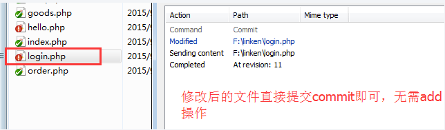

>author：MierX

>github：[StudyPhp](https://github.com/MierX/StudyPhp)

>create：21.6.23 18:14

>motto ：有志者，事竟成
---
#   01
    学习第一天的知识
##  昨天内容回顾
    TODO
##  SVN - 介绍
    svn：
        SubVerSion（子级版本，子级源代码版本控制管理软件），管理着随时间改变的数据
        这些数据放置在一个中央资料档案库repository中
        这个档案库很像一个普通的文件服务器,不过它会记住每一次文件的变动
        这样你就可以把档案恢复到旧的版本,或是浏览文件的变动历史
        许多人会把版本控制系統想像成某种“时光机器”
    作用：
        同一个项目有三个程序员共同开发，不可避免的情况是同一个程序文件有可能三个人都开发、
        这样他们在不同时间段之内给服务器上传自己开发好的文件的时候就会出现“文件覆盖”的情况
        后上传的文件会覆盖先上传的文件
        SVN作用之一就是避免上述情况发生
        ①：多人开发同一个项目不会出现代码覆盖情况
        ②：针对一个文件可以创建许多不同版本，并且可以随时查看不同版本的内容
        ③：公司领导可以通过svn查看每个人的工作情况

##  SVN - 服务器端和客户端软件安装
    TODO

##  SVN - 为SVN服务器端创建代码仓库
    给svn服务器端创建多个代码仓库，用于存储不同开发项目的程序源代码
    svnadmin create 仓库绝对路径：通过cmd执行，来创建仓库

##  SVN - 启动仓库服务（本地与仓库连接）
    svnserver -d -r 仓库地址：启动仓库服务（-d后面可接端口号，svn服务采用svn协议，默认是3690，-r后接仓库地址，该命令窗口不可关闭）
    右键、checkout(检出)：在客户端中使用

##  SVN - 开启仓库匿名账号权限（提交第一个程序文件）
    给svn仓库提交第一个程序文件：
        首先右键、svn、add：本地的.svn对该文件形成管理,每个文件只需要一次add操作接口
        最后右键、commit（提交）：本地的文件提交给svn仓库
    文件颜色标志：
        蓝色加号：本地的.svn对该文件有形成管理
        绿色对号：本地文件、.svn管理的版本文件、仓库文件三者内部一致
        红色叹号：本地文件与.svn和仓库文件不一致(用户自己修改了该文件)
        黄色叹号：表示该文件正处于冲突状态
        蓝色问号：新建的一个文件，本地.svn和远程仓库对该文件都没有记录

##  SVN - 新目录提交文件细节和一键commit快速提交文件
    多个程序员给仓库提交文件:
        首次使用svn执行checkout，同时会把仓库最新程序文件更新到本地
        给仓库提交程序文件，执行commit指令
        把仓库最新的程序文件更新到本地，执行update指令
        后期 commit 和 update 指令要频繁使用
    一键commit同时提交多个文件：
        为了加快文件的提交速度，可以在项目文件目录右键点击commit，svn会把当前目录及内部所有子级递归目录需要提交的文件给选定供commit操作
    新目录文件的提交：
        新目录内部的文件不能直接提交，必须是目录本身已经提交给仓库了，该目录文件才可以提交

##  SVN - 开启多个仓库服务及就用户更换主机名地址
    开启多个仓库服务：
        svnserve -d -r 仓库地址的上级目录：将上级目录下所有的仓库开启服务
    用户更换svn主机名地址：
        删除.svn文件，断开与仓库的联系
        重新checkout并根据svn新主机名建立与仓库的新联系

##  SVN - 文件不同版本切换
    一个程序文件可以在svn仓库里边形成许多不同版本，并可以随时查看、对比

##  SVN - 冲突
    两个程序员在短时间内对同一个文件进行修改，并进行提交
    后提交的文件会尝试覆盖先提交者的文件，但是不会成功，因为有“冲突”机制避免此情况发生
    svn的冲突：
        广义：提交程序文件本地版本号码小于仓库服务器版本号码
        侠义：多个程序员对同一个文件、同一处代码进行修改，在他们提交文件的时候会产生冲突

##  SVN - 冲突解决
    令牌方式解决：
        给每个文件设置令牌，谁获得令牌谁有权利开发该文件
        vss（visual source safe）源代码控制管理软件使用该方式
    通过版本号码控制：
        用户commit文件，本地文件版本与仓库版本号码必须一致才可以提交，否则禁止提交
        svn就是通过版本号码解决冲突
    冲突的具体形式：
        大家修改的代码不在同一处：
            执行upadate操作，把仓库最新的文件更新到本地，并和本地文件做Merge融合操作，再提交本地修改的文件
        大家修改的代码在同一处：
            执行update操作，把最新的版本更新到本地，与本地文件做merge融合操作后，再对冲突的文件进行修改合并后再提交

##  SVN - 账号和权限设置
    TODO

##  SVN - 给组别设置权限
    TODO

##  SVN - 开启只操作某个目录的权限
    首先管理员先在仓库中创建新目录video并提交给svn仓库
    然后给外部团队设置账号和设置工作目录、分支目录权限
    然后外部团队建立与仓库分支目录的联系
    然后外部团队给该目录提交文件
    最后管理员执行update操作，把该分支目录从仓库更新下来即可查看外部团队的工作情况

##  SVN - 设置开机启动项服务
    TODO

##  SVN - 实现SVN查看bug
    TODO

##  SVN - 模拟真实环境使用
    TODO
