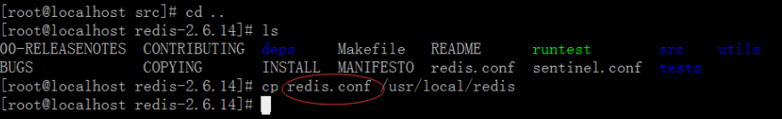
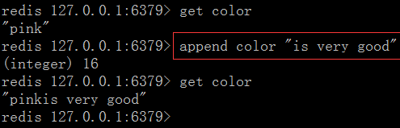
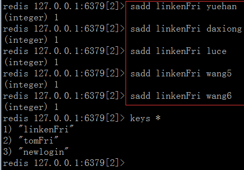
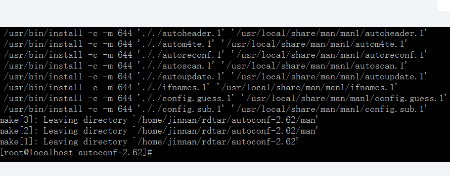

>author：MierX

>github：[StudyPhp](https://github.com/MierX/StudyPhp)

>create：21.6.25 09:55

>motto ：有志者，事竟成
---
#   01
    学习第一天的知识
##  Redis - 缓存介绍
    什么是Redis：
        Redis是Remote Dictionary Server（远程数据服务）的缩写
        由意大利人antirez（Salvatore Sanfilippo）开发的一款内存高速缓存数据库
        该软件使用c语言编写，它的数据模型为key - value模型
        它支持丰富的数据结构（类型），如string、list、hash、set、sorted set等
        可持久化保存（随时把备份到硬盘中一份），保证了数据安全
    出现的原因：
        使用数据库服务，同一个select查询语句，可能每天需要被执行上百万次
        为了减轻数据库的负载，就把查询好的数据给缓存起来（存储在内存中）
        每天的第一个用户执行从mysql中获得数据并存储到redis内存中，之后的用户可以直接从redis内存中获得数据
        使用缓存减轻数据库的负载：
            在开发网站的时候，如果有一些数据在短时间内不会发生变化
            而它们还要被频繁访问，为了提高用户的请求速度和降低网站的负载
            就把这些数据放到一个读取速度更快的介质上（或者是通过较少的计算量就可以获得该数据）
            该行为就称作对该数据的缓存
            该介质可以是文件、数据库、内存等，内存介子经常用于数据缓存
    缓存的两种形式：
        页面缓存经常用在CMS（content manage system）内存管理系统里边（如Smarty缓存）
        数据缓存经常会用在页面的具体数据里

##  Redis - 安装和简单使用
    前台启动服务：始终有一个终端脚本被挂起执行(终端脚本被关闭后立即停止服务，不推荐)
    后台启动服务：服务以隐藏的方式执行，没有终端脚本，可以通过ps -A | grep 名称 查看是否有该服务。
    ./redis-server：redis前台启动服务
    ./redis-server redis.conf：redis后台启动服务
    Ctrl+c：关闭前台服务
    redis中数据的模型为：key/value，类似在php中定义变量：名称 = 值;
    redis.conf配置文件说明：
        daemonize no：默认情况下，redis不是在后台运行的，如果需要在后台运行，把该项改为yes
        pidfile /var/run/redis.pid：当redis在后台运行的时候，redis默认会把pid文件放在/var/run/redis.pid，可以配置到其它地址，当运行多个redis服务时，需要指定不同的pid文件和端口
        port：监听端口，默认为6379
        bind 127.0.0.1：指定redis只接收来自于该IP地址的请求，如果不进行设置，那么将处理所有请求，在生产环境中为了安全最好设置该项
        timeout 0：设置客户端连接时的超时时间，单位为秒，当客户端在这段时间内没有发出任何指令，那么关闭该连接
        tcp-keepalive 0：指定TCP连接是否为长连接，“侦探”信号由server端维护，默认0表示禁用
        loglevel noticce：log等级分为4级，debug、verbose、notice、warning，生产环境下一般开启notice
        logfile stdout：配置log文件地址，默认使用标准输出，即打印在命令行终端的窗口上，也可以修改为日志文件对应的目录地址
        database 16：设置数据库的个数，可以使用select命令来切换数据库，默认使用的数据库时0号库，默认有16个库
        save 900 1 save 300 10 save 60 10000：保存数据快照的频率，即将数据持久化到dump.rdb文件中的频度。用来描述在“多少秒期间至少多少个变更操作”触发snapshot数据保存动作。默认设置为如果60秒内有10000个keys或者在300秒内有10个keys或900秒内有1个keys发生变化则镜像备份

##  Redis - Key的操作
    在redis里，除了“\n”和空格不能作为key的组成内容外，其它内容都可以作为key的组成，key没有长度要求
    keys键操作：
        exists key：指定key是否存在
        del key1 key2 ... keyN：删除指定的key
        type key：返回指定key的value的类型
        keys pattern：返回匹配指定模式的所有key
        rename oldkey newkey：将指定oldkey改名为newkey
        dbsize：返回当前数据库的key数量
        expire key seconds：为key指定过期时间
        ttl key：返回指定key的剩余过期秒数
        select db-index：选择指定数据库
        move key db-index：将指定key从当前数据库移动到指定数据库
        flushdb：删除当前数据库中所有key
        flushall：删除所有数据库中的所有key

##  Redis - String类型操作
    string是redis最基本的数据类型
    redis的string可以包含任何数据，包括图片或序列化的对象
    单个value值的最大上限是1G字节
    string类型操作：
        set key value：设置key对应的值为string类型的value
        mset key1 value1 ... keyN valueN：一次设置多个key的值
        mget key1 key2 ... keyN：一次获取多个key的值
        incr key：对key的值做自增操作，并返回新的值
        decr key：对key的值做自减操作，并返回新的值
        incrby key integer：同incr，但可以指定自增的值
        decrby key integer：同decr，但可以指定自减的值
        append key value：给指定key的字符串值追加value
        substr key start end：返回截取过的key的字符串值

##  Redis - List链表类型操作
    list类型其实就是一个双向链表，通过push、pop操作从链表的头部或者尾部添加或删除元素
    这使得list既可以用作栈，也可以用作队列
    栈：先进先出
    队列：先进后出

##  Redis - Set集合类型操作
    reids的set是string类型的无序集合
    set元素最大可以包含2的32次方-1个元素
    关于set集合类型除了基本的添加、删除操作，其它有用的操作还包含集合的取并集（union）、交集（intersection）、差集（difference）
    通过这些操作可以很容易的实现类似sns中的好友推荐功能
    注意：
        每个集合中的各个元素不能重复
    set类型操作：
        sadd

##  Redis - SortSet排序集合类型操作
    Sort Set是list和set两种类型的集中体现，称为排序集合类型
    和set一样，sorted set也是string类型元素的集合
    不同的是每个元素都会关联一个权
    通过权/值可以有序的获取集合中的元素
    sorted set排序类型操作：
        zadd key score member：添加元素到集合，元素在集合中存在则更新对应score
        zrem key member：删除指定元素，1表示成功，如果元素不存在则返回0
        zincrby key incr member：按照incr幅度增加对应member的score值，返回score值
        zrank key member：返回指定元素在集合中的排名（下标），集合中元素是按score从小到大排序的
        zrevrank key member：同上，但是集合中元素是按score从小到大排序
        zrange key start end：类似lrange操作从集合中去指定区间的元素，返回的是有序结果
        zrevrange key start end：同上，返回结果是score逆序的
        zcard key：返回集合中元素个数
        zscore key element：返回给定元素对应的score
        zremrangebyrank key min max：删除集合中排名在给定区间的元素

##  Redis - 持久化（快照）操作
    redis（nosql产品）为了内部数据的安全考虑，会把本身的数据以文件形式保存到硬盘中一份，在服务器重启之后，会自动把硬盘的数据恢复到redis内存里
    数据保存到硬盘的操作被称为“持久化”操作
    snap shotting快照持久化：
        该持久化默认开启，一次性把redis中全部的数据保存一份存储在硬盘中，如果数据非常多（10-20G）就不适合频繁进行该持久化操作
    手动发起快照持久化：使用./redis-cli bgsave执行

##  Redis - 持久化（AOF）操作
    append only file：AOF持久化
    AOF本质：把用户执行的每个“写”指令（包含添加、修改、删除）都备份到文件中，还原数据的时候就是重新执行这些指令
    AOF持久化默认是关闭的，在redis.conf中修改appendonly的值为yes来后重启redis服务来开启
    注意：AOF持久化开启后会自动清除目前redis中的全部数据
    AOF备份的频率：
        appendfsync always：每次收到写命令就立即强制写入磁盘，最慢的，但是保证完全的持久化，不推荐使用（数据最安全、服务器性能低）
        appendfsync everysec：每秒钟强制写入磁盘一次，在性能和持久化方面做了很好的折中，推荐（数据较安全、服务器性能中等）
        appendfsync no：完全依赖 os，性能最好,持久化没保证（数据不安全、服务器性能优良）
    AOF持久化相关指令：
        bgsave：异步保存数据到磁盘（快照保存）
        lastsave：返回上次成功保存到磁盘的unix时间戳
        shutdown：同步保存到服务器并关闭redis服务器
        bgrewriteaof：当日志文件过长时优化AOF日志文件存储
        ./redis-cli bgrewriteaof
        ./redis-cli bgsave
        ./redis-cli -h 127.0.0.1 -p 6379 bgsave：手动发起快照

##  Redis - 主从模式设置
    mysql为了降低每个服务器负载，可以设置读写分离（写服务器、读取服务器）
    redis为了降低每个服务器的负载，可以多设置几个，并做主从模式
    一个服务器负载“写”数据，其它服务器负载“读”数据
    主服务器数据会“自动”同步给从服务区

##  Redis - 给php安装redis扩展
    安装php的redis扩展：
        redis与其他软件(xml、gd、jpeg等等)都是php的扩展(php依赖扩展软件)
        正确的安装顺序是先安装依赖软件、之后在安装php软件
        此时redis与php的安装顺序有前后颠倒的意味，但是php允许redis反方向安装进来。

##  Redis - php实现redis操作
    获得Redis类内部一共的方法(利用反射Reflection实现)：
    php大部分操作都是正向的：类、实例化对象、对象调用成员
    其实类可以反向操作：类、反过来感知类的成员、反方向感知方法是否是公开的/私有的/受保护的/最终的
