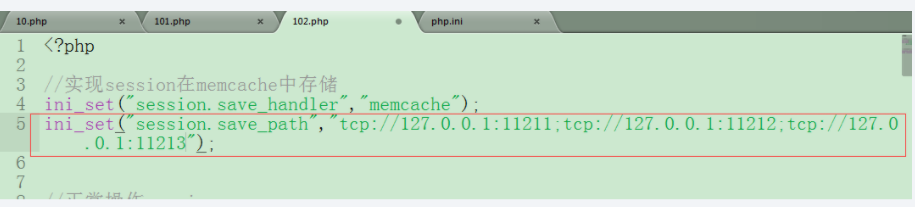
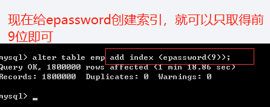
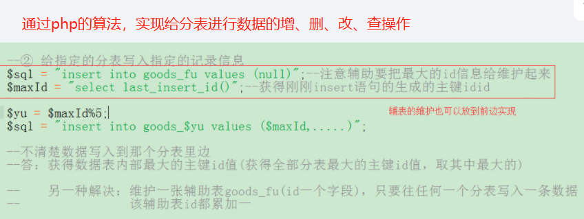
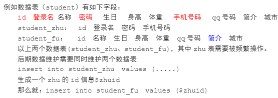
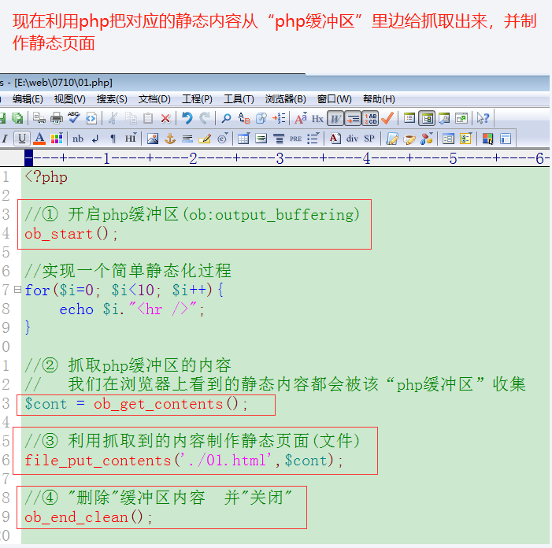

>author：MierX

>github：[StudyPhp](https://github.com/MierX/StudyPhp)

>create：21.6.29 17:50

>motto ：有志者，事竟成
---
#   01
    学习第一天的知识
##  Memcache - 核心优化概述
    系统核心优化思路：以小博大，利用最小的资源换取最大的汇报
    工具：memcache、mysql优化、静态化技术

##  Memcache - 与Redis的比较
    memcache：memory cache，内存缓存技术
    memcache或redis是中间介质，可以帮助我们通过php语言实现对内存的操作
    memcache与redis的区别：
        memcache：
            每个key的数据最大支持1M
            发布的早，对各种技术支持比较全面，session可以存储memcache中，各种框架（如TP）对memcache支持的比较好
            比较老牌、传统的内存缓存技术
            适合存储简单、实用的数据
            数据类型只有string
            没有持久化
        redis：
            每个key的数据最大是1G
            对各种技术支持没有memcache好
            新兴的内存缓存技术
            适合做集合计算（list/set/sorted set）
            数据类型较丰富（string/list/set/sorted set/hash）
            有持久化
    memcache与redis的联系：
        数据存储在内存当中，数据模型都是key/value
        两种内存缓存技术都要掌握，大家有各自擅长的地方
        memcache：对session支持，各种框架支持
        redis：集合计算

##  Memcache - 安装与开启服务
    TODO


##  Memcache - 开启php对应的扩展
    TODO：


##  Memcache - php操作有效期问题
    在php中memcache体现为“类memcache”
    具体使用：实例化对象，对象调用成员方法即可
    具体操作：
        设置：
            $obj->set(key, value, 0/1是否有压缩, 有效期)
            是否压缩：
                压缩，不考虑速度，计较内存空间
                不压缩，考虑速度，不计较内存空间
            有效期：
                秒
        获取：
            $obj->get(key)
        删除：
            $obj->delete(key)
    memcache中key的命名：
        除了空格不能作为key的组成部分，长度不能超过250字节
    memcache有效期：
        为0即不失效
        两种方式：
            时间戳方式：1970-01-01到目前的秒数
            时间差：时间数字，从目前往后延伸的时间长度，时间差的值大到一定程序与时间戳的值可以保存一致（不能超过30天，会被视为时间戳）


##  Memcache - 各种数据类型的存储
    php的数据类型：
        基本类型：int、string、boolean、float
        复合类型：array、object、resource、null
    有的时候在memcache中需要把各种数据类型信息都变为字符串存储，就需要对复合类型信息进行序列化操作:
        serialize()
        unserailize()
    第三个参数压缩作用：通过zlib进行压缩处理


##  Memcache - php中其他方法介绍
    add()：给memcache增加一个key，不存在就增加，存在则报错
    set()：给memcache设置一个key，不存在就增加，存在则修改
    close()：关闭memcache连接，一般设置在脚本最后
    decrement()：给指定key的值自减1
    increment()：给指定key的值自加1
    flush()：清空memcache的全部key
    replace()：替换key的值为其他值，存在就替换，不存在就报错
##  Memcache - Telnet终端操作
    telnet是远程登录协议
    telnet提示不是内部或外部指令的解决：控制面板--》程序和功能--》打开或关闭windows服务--》telnet客户端
    在终端窗口实现memcache的操作：
        设置：
            > set key 是否压缩  有效期  数据长度  [回车]
            > 数据
    
            > add  key  是否压缩  有效期  数据长度  [回车]
            > 数据
    
            > replace  key  是否压缩  有效期  数据长度 [回车]
            > 数据
            注意：数据真实长度与设置长度要完全一致
        获取：
            > get  key
        删除：
            > delete key
            > flush_all：删除全部的key
    获取memcache统计的信息：
        在php程序里边可以通过getStats()获得memcache服务器的统计信息


##  Memcache - 分布式设计
    分布式：如果单个memcache保存的数据非常多，memcache本身工作负载就会非常高，为了降低该memcache的工作量，提高其运行速度，可以设置多个memcache平均分担工作量
    redis的分布式是“主从模式”结构，一主多从
    memcache的分布式与Redis的不同，其是把一台memcache的工作平均分配给多个memcache分担
    分布式的具体实施：
        可以在一个服务器里边开启多个memcache服务
        可以配置多个服务器，每个服务器里都运行memcache服务
        每个memcache服务器都是平等的，中间通过“算法”保证数据的平均分配
        php代码的编写还保持原有习惯即可
        key的分配原则：依次轮询、求余


##  Memcache - 分布式设计具体使用
    TODO


##  Memcache - 缓存失效
    缓存失效：memcache中的key超过有效期、或被系统强制删除掉了
    有效期过期：
        session信息过期(失效了)，通过“懒惰”模式给删除的
        session是在文件中存储，如果session已经过期，其文件还是存在的，下次有一个用户访问session信息(用户登录系统)，此时已经过期的session就有一定的几率被删除(session文件被删除)
        memcache中key的删除也是懒惰模式，如果超过有效期，该key还是存在的，当你get获取它的时候，其就消失了
    空间不足被强制删除：
        memcache的内存可用空间默认为64MB，如果存储的数据非常多，可用空间不足了，此时仍然可以存储数据，因为memcache内部有LRU机制
        LRU: Least  recently use（最近很少被使用的数据），内存空间如果不足，就会删除最近很少经常使用的数据
        如果不想使用LRU机制，就可以在开启memcache服务的时候设置参数-M
        -M:内存空间耗尽，要报错，而不使用LRU机制删除数据


##  Memcache - session存储在memcache介绍
    传统session的数据是在硬盘的文件中存储的
    该session很大情况用于存储用户的相关信息
    两个服务器的session如果是文件形成存储，则他们的session互相不能通信
    两个服务器的session如果是存储在memcache中的，则他们的session可以通信
    一个网站是有多个服务器支撑的，用户在服务器1里边登录系统，其session持久化的信息报保存在一个memcache服务器里边，这样服务器2/3/4也可以去memcache读取session信息，就可以保证用户访问各个服务器的时候无需重复登录系统

##  Memcache - session存储在memcache操作
    php.ini关于session的设置：



##  Memcache - tp框架案例应用
    在网站前台商品列表页面处，给商品列表信息存储在memcache中，这样许多人在访问的时候就通过memcache获得数据，提供页面的请求速度
    在thinkphp框架中使用memcache缓存：
        通过S()函数连接memcache服务：S(array(type=>’memcache’,‘host’=>主机名,’port’=>端口号码)) 
        操作key：S(key,value,有效期);
        获取key：S(key);
        删除key：S(key,null);


#   02
    学习第二天的知识
##  MySQL优化 - 昨天内容回顾
    TODO
##  MySQL优化 - 优化概述及存储引擎介绍
```
优化概述：
    存储层：存储引擎、字段类型选择、范式设计
    设计层：索引、缓存、分区（分表）
    架构层：多个mysql服务器设置，读写分离（主从模式）
    sql语句层：多个sql语句都可以达到目的的情况下，要选择性能高、速度快的sql语句
存储引擎：
    我们使用的数据是通过一定的技术存储在数据库当中
    数据库的数据是以文件形式存储在硬盘中
    存储的技术不止一种，并且每种技术都有自己独特的性能和功能
    存储数据的技术和其功能的合并就被称为“存储引擎”
    在mysql中经常使用的存储引擎：myisam、innodb等
```

```
数据库的数据存储在不同的存储引擎里边，所有的特性就与当前的存储引擎有一定关联
需要按照项目的需求、特点选择不同的存储引擎
```
##  MySQL优化 - innodb和myisam表的具体特点

### innodb
```
数据库每个数据表的数据设计的三方面信息：表结构、数据、索引
innodb的技术特点是：支持事务、行级锁定、外键
```

```
表结构、数据、索引的物理存储：
    所有innodb表的数据和索引信息都存储在ibdata1文件中
    给innodb类型表的数据和索引创建自己对应的存储空间：
        默认情况下每个innodb表的数据和索引不会创建单独的文件存储
    后期无论innodb_file_per_table的设置状态如何变化，在innodb_file_per_table为ON期间创建的表的数据和索引都有独立的存储位置
```


```
数据存储顺序：
    innodb表数据的存储是按照主键的顺序（即使sql插入时的主键是错乱的）排列每个写入的数据
    该特点决定了该类型表的写入操作较慢
```


```
事务、外键：
    该类型数据表支持事务、外键
    事务：
        把许多写入（增删改）的sql语句捆绑在一起，要么一起执行，要么不执行
        事务经常用于与“钱”有关的业务
        事务的四个特性：原子性、一致性、持久性、隔离性
        具体操作：
            start transaction;开启事务
            sql语句...
            如果sql语句有误：
                rollback;回滚
            commit;否则提交
    外键：
        两个数据表A、B，B表的主键是A表中的某个普通字段，这个字段就是A表的外键，外键的使用有一定的约束
        约束：A、B表中，必须先有B表的数据，才能有A表的数据，A表的外键的值必须于B表的主键值集合中存在
        真实项目里面很少使用“外键”，因为有约束
并发性：
    该类型表的并发性非常高
    多人同时操作该数据表
    为了操作数据表的时候，数据内容不会随便发生变化，要对信息进行“锁定”
    该类型锁定级别为“行锁”，只锁定被操作的当前记录
```
##  MySQL优化 - myisam压缩技术
### Myisam
```
结构、数据、索引独立存储：
    该类型的数据表、表结构、数据、索引都有独立的存储文件
    *.frm：表结构文件
    *.MYD：表数据文件
    *.MYI：表索引文件
```


```
数据存储顺序：
    myisam表数据的存储是按照自然顺序排列每个写入的数据
    该特点决定了该类型表的写入操作较快
```

```
并发性：
    该类型并发性较低
    该类型的锁定级别为“表锁”
压缩技术：
    如果一个数据表的数据非常多，为了节省存储空间，需要对该表进行压缩处理
```


##  MySQL优化 - myisam压缩技术和存储引擎选择
    压缩工具：myisampack.exe
    压缩方法：myisampack.exe 表名


    重建索引：myisamchk.exe-rq表名


    解压缩工具：myisamchk.exe--unpack表名


    压缩的数据表有特点：
        不能频繁的写入操作，只是内容固定的数据表可以做压缩处理（如：存储全国地区信息的数据表）
        如果必须要写数据：就解压该数据表，写入数据，再压缩


    更新解压后的数据：flush table 表名


    innodb与myisam的比较：
        innodb存储引擎：适合做修改、删除
        myisam存储引擎：适合做查询、写入
    Archive存储引擎：
        归档型存储引擎，该引擎只有写入、查询操作，没有修改、删除操作
        适合“日志”性质的信息存储
    memory存储引擎：
        优点：内存型存储引擎，操作速度非常快速，比较适合存储临时信息
        缺点：服务器断电的话，该存储引擎的数据会立即丢失
    存储引擎的选择：
        myisam和innodb：
            网站大多数情况下“读写”操作非常多，适合选择myisam类型，例如dedecms、phpcms等内容型网站
            网站对业务逻辑有一定要求，适合选择innodb，如办公网站、商城
            mysql5.5默认存储引擎都是innodb
##  MySQL优化 - 字段类型选取
    字段类型选择
        尽量少的占据存储空间
            整型：
                tinyint(1)
                smallint(2)
                mediumint(3)
                int(4)
                bigint(8)


            时间类型：
                time()：时分秒
                datetime()：年月日 时分秒
                year()：年份
                date()：年月日
                timestamp()：时间戳（1970-1-1至今的总秒数）
                根据不同时间信息的范围选取不同类型的使用
        数据的整合最好固定长度：
            char(n)：长度固定，运行速度快，n最大为255
            varchar(n)：长度不固定，内容比较少要进行部位操作，该类型要保留1-2个字节保存当前数据的长度，n最大为65535
        信息最好存储为整型的：
            时间信息可以存储为整型的，如时间戳
            格式化时间戳语法：select from_unixstamp(时间戳字段) from 表名
            set集合类型（多选类型）：set('篮球', '足球', '棒球', ...)
            enum枚举类型（单选类型）：enum('男', '女')
            推荐使用set和enum类型，mysql内部会通过整型信息参数具体计算、运行
            ip地址也可以变为整型信息进行存储，mysql内部有算法，可以把ip变为一串数字


            mysql的ip算法：
                inet_aton(ip)：将ip转化为数字串
                inet_ntoa(数字串)：将数字串转化为ip
            php的ip算法：
                ip2long(ip)：将ip转化为数字串
                long2ip(数字)：将数字串转化为ip
##  MySQL优化 - 逆范式
    数据库设计需要遵守三范式


        select c.cat_id,c.name,count(c.*) from category as c left join goods as g on g.cat_id=c.cat_id
        上边的sql语句是一个多表查询，并且还有count的聚合计算
        如果这样的需求很多，类似的sql语句查询速度就会没有优势
        如果需要查询速度提升，最好设置为单表查询，并且不要聚合计算


        以上对经常使用的需求做优化，增加了一个字段，该字段的数据其实通过另一个表做聚合计算可以获得，该设计就不满足三范式，因此被称为“逆范式”
    什么是三范式：
        一范式：
            原子性，数据不可以再细分分割
        二范式：
            数据没有冗余


        三范式：
            数据表的每个字段与当前表的主键产生直接关联（非间接关联）

##  MySQL优化 - 是否使用索引的比较
    索引（index）：
        索引是优化数据库设计，提升数据库性能非常显著的技术之一
        各个字段都可以设计为索引，经常使用的索引就是主键索引（primary key）
        索引可以明显提升查询sql语句的速度
    是否使用索引的速度的差别：


##  MySQL优化 - 什么是索引
    索引本身是一个独立的存储单位，在该单位里边有记录着数据表某个字段和字段对应的物理空间
    索引内部有算法支持，可以使得查询速度非常快


    有了索引，我们根据索引为条件进行数据查询速度就非常快
        索引本身有“算法”支持，可以快速定位我们要找到的关键字（字段）
        索引字段与物理地址有直接对应，帮助我们快速定位到要找的信息
    一个数据表的字段都可以设置索引
##  MySQL优化 - 索引具体操作（创建和删除）
    索引类型：
        主键索引（primary key）：
            auto_increment必须给主键索引设置，字段要求不能为空，字段值唯一
        唯一索引（unique key）：
            字段值在表中不能重复
        普通索引（index）：
            无具体要求
        全文索引（fulltext index）：
            myisam数据表可以设置该索引
    复合索引：索引关联的字段十多个组成的，该索引就是复合索引


    索引的操作：
        创建索引：
            方法一：
                创建数据表时，就给字段设置好索引


                查看表结构的语法：show create table 表名


            方法二：
                给现有的数据表添加索引
                语法：alter table 表名 add 索引类型 索引名称(索引字段, ...)


        删除索引：
            语法：alter table 表名 drop 索引类型 [索引名称]
            如果是删除主键索引，就不需要索引名称，但是由于索引字段内部有auto_increment属性，所以不能删除，需要先删除该属性（修改该字段的属性），才可以删除


##  MySQL优化 - 执行索引计划
    执行计划（explain）：
        针对查询语句设置执行计划，当前数据库只有查询语句支持计划
        每个select查询sql语句执行之前，需要把该语句用到的各方面资源都计划好，如：
            cpu资源、内存资源、索引支持、涉及到的数据量等
        查询sql语句真实执行之前所有的资源计划就是执行计划
        我们讨论的执行计划，就是看看一个查询sql语句是否可以使用上索引
        具体操作：
            explain 查询sql语句\G


##  MySQL优化 - 适合索引的场景
    where查询条件：
        where之后设置的查询条件字段都适合做索引
    排序查询：
        order by 字段名：用于排序的字段适合做索引


    索引覆盖：


        
        我们查询的全部字段（ename，job）已经在索引里边存在，就直接获取即可
        不用再到数据表中获取，因此被称为“索引覆盖”
        该查询速度非常快，效率高，该索引也被称为“黄金索引”


    连接查询：
        在数据表中给外键或者约束字段设置索引，可以提高联表查询的速度

##  MySQL优化 - 索引使用原则
    字段独立原则：
        select * from 表名 where 字段名=值：字段名条件字段独立
        select * from 表名 where 字段名+2=值：字段名条件字段不独立
        只有独立的条件字段才可以使用索引


    左原则：
        模糊查询（like）：
            like %：关联多个模糊内容
            like _：关联一个模糊内容
            select * from 表名 where 字段名 like "模糊内容%"：可以使用索引
            select * from 表名 where 字段名 like "模糊内容_"：可以使用索引


    复合索引：
        复合索引内部中有多个字段，前者字段可以作为查询条件使用复合索引，后者字段作为查询条件不能使用复合索引


    or原则：
        or左右的关联条件必须都具备索引才可以使用索引


#   03
    学习第三天的知识
##  MySQL优化 - 昨天内容回顾
    TODO
##  MySQL优化 - 索引设计依据
    要估算每个数据表全部的查询sql语句类型
    分析、统计每个sql语句的特点（where、order by、or等）
    原则：
        被频繁执行的sql语句要设置
        执行时间比较长的sql语句（可以统计）
        业务逻辑比较重要的sql语句（例如支付宝2小时内答应返现的业务逻辑）
##  MySQL优化 - 索引前缀
    设计索引的字段，不适用全部内容，而只使用该字段前面一部分内容
        count()：统计查询结果的行数
        distinct 字段名：指定查询字段去重
        substring(字段名, n, m)：截取字段值的从n位到m位的部分出来
    如果字段的前N位的信息已经足够可以标识当前记录信息，就可以把前N位信息设置为索引内容，好处：
        索引占据的物理空间小
        运行速度就非常快




##  MySQL优化 - 全文索引
    索引设计原则：
        字段内容需要足够花样
        性别字段不适合做索引
    全文索引：
        MySQL5.5中myisam存储引擎支持全文索引
        MySQL5.6中myisam和innodb存储引擎都支持全文索引
        目前中文不支持全文索引


##  MySQL优化 - 索引结构（非聚集）
    索引内部有算法，算法可以保证查询速度比较快速
    算法的基础就是数据结构
    索引的直接称谓就是“数据结构”
    在MySQL数据库中，索引是存储引擎层面的技术
    不同的存储引擎使用的数据结构是不一样的
    
    索引结构：
        非聚集索引结构（如myisam）
        聚集索引结构（如innodb）
    
    myisam非聚集索引结构：
        又被称为B+Tree索引结构


##  MySQL优化 - 索引结构（聚集）
    B+Tree索引结构（聚集型，两种情况）：
        主键索引结构：
            叶子节点的关键字（如主键id值）对应整条记录信息
        非主键索引结构：
            唯一、普通等
            叶子节点的关键字对应主键id值


    非主键索引 -> innodb的主键索引 -> 整条记录
    innodb表物理文件的索引和数据是在一起的


    概念问题：
        B+Tree是B-Tree的一个变形：
            B-Tree与B+Tree的明显区别是，B-Tree的每个节点的关键字都是与物理地址对应
        Binary Tree：二进制树结构
##  MySQL优化 - 查询缓存
    一条sql查询语句有可能获得很多数据，并且有一定的时间消耗
    如果该sql语句被频繁执行获得数据（这些数据还不经常发生变化），为了使得每次获得信息的速度更快
    就可以把执行结果给缓存起来，供后续的每次使用
    
    查看并开启查询缓存：
        show vatiables like ''query_cache%;


    缓存失效：
        数据表或数据有变动（增删改），会引起缓存失效


    什么情况下不会使用缓存：
        sql语句有变动的信息，就不使用缓存（如时间信息、随机数）


    生成多个缓存：
        获得相同结果的sql语句，如果有空格、大小写等sql语句上的内容不同，也会分别进行缓存


    不进行缓存：
        针对特殊语句不需要缓存


    查看缓存空间状态：
        show status like 'Qcache%';


##  MySQL优化 - 分表分区概述
    一个数据表里边可以存储多条记录信息
    如果一个数据表里存储的数据非常多（如淘宝商品表、订单表）
    这样该表的相关工作量就很多（增删改查）
    负载（工作量）高到一定程度，会造成把表锁死的情况发生
    为了降低表的负载，可以给该表拆分为多个数据表，这样单个数据表的工作量会有所降低
    
    MySQL5.1版本之后就支持分表分区的设计：
        宏观拆分可以如下：表_1、表_2、表_3...
    
    数据表拆分以后，需要考虑php如何操作这些数据表：
        php -> 手动/mysql算法 -> 数据表（分表）
        
    手动算法：
        需要在php语言里设计操作逻辑。增加php语言的代码工作量
    mysql算法：
        php语言不需要做额外操作就可以像以往一样操作同一个数据表的不同分区。是mysql分表推荐的方式

    
    创建一个“分表/分区”数据表：
        myisam和innodb数据表都可以做分表设计
        推荐使用myisam存储引擎
        设计分区的字段，需要是主键的一部分
        语法：创建表语句的最后跟上“partition by key(主键名) partitions 分区数”


        上图每个分区表都有独立的*.MYD数据文件和*.MYI索引文件，给该表存放信息，信息会平均分摊到各个数据表里
##  MySQL优化 - 四种分区算法
    各种分区设计关联的字段必须是主键的一部分，或者是主键本身，或是复合主键索引的从属主键部分
    求余算法：
        key：根据指定的字段进行分区设计
        hash：根据指定的表达式进行分区设计
    条件算法：
        range：字段/表达式，符合某个条件范围的分区设计
        list：字段/表达式，符合某个列表范围的分区设计
    
    key分区算法：


    hash分区算法：
        根据指定的表达式进行分区设计
        设计分区的时候，分区字段必须是主键的一部分


    range分区算法：


    list分区算法：


    key分区算法：
        该方式分区不明显（不一定会严格将数据平均写入分区），但大方向（数据量大之后）明显
    hash/range/list分区方法：会根据业务特点（设置好的分区规则）严格将数据写入到对应的分区表里边
##  MySQL优化 - 分区增加减少管理
    管理分区：增加、减少分区
    
    求余（key、hash）算法管理：
        增加分区语法：
            alter table 表名 add partition partitions 数量;
        减少分区语法：
            alter table 表名 coalesce partition 数量;
            注意：减少分区会丢失数据


    条件（range、list）算法管理：
        增加分区语法：
            alter table 表名 add partition(
                partition 分区名 values in/less than (常量/列表),
                partition 分区名 values in/less than (常量/列表),
                ...
            );
        减少分区语法：
            alter table 表名 drop partition 分区名称;
            注意：减少分区会丢失数据


##  MySQL优化 - 物理分表设计
    物理分表即将表人为分成表_1，表_2，表_3...
    物理分表需要通过php算法，实现数据平均分配给每个表存储



##  MySQL优化 - 垂直分表设计
    对记录进行分割并存储到分表中，称为“水平分表”
    对字段进行分割并存储到分表中，称为“垂直分表”
    
    一个数据表，内部有许多字段，有的字段频繁被操作，有的字段很少被操作
    这样当操作数据表中的某些字段时候，没有直接业务关系的字段也需要给其分配相应的资源，这样速度就会变慢，还会消耗系统额外的工作量

##  MySQL优化 - 架构设计
    一个MySQL服务器的操作分为：增删改查
    其中查询操作最为频繁：查询/写入 = 7/1
    查询操作本身还是最消耗资源的
    
    架构设计：
        原先有一个MySQL服务器做的工作现在平摊给多个MySQL服务器实现
        多个数据库设计与redis的分布式设计相似
        主从模式（一主多从/读写分离）


        安装多个服务器（多个MySQL服务器）
        负载均衡（软件级：便宜 硬件级：性能更好）
        主MySQL给从MySQL同步数据
##  MySQL优化 - 慢查询日志设置
    系统运行起来，内部需要执行许多sql语句
    此时要把查询速度很慢的sql语句给统计出来，并做优化设计
    设定一个时间阈值，超过该时间，就说明sql语句很慢
    
    查看慢查询语法：
        show variables like 'slow_query%';


    开启慢查询日志语法：
        set global slow_query_log = 1;


    查看慢查询的时间阈值语法：
        show variables lile 'long_query_time%';


    设置时间阈值语法：
        set long_query_time = 2;


#   04
    学习第四天的知识
##  静态化 - 昨天内容回顾
    TODO
##  静态化 - 大量数据写入优化
    保证数据非常快地写入到数据库中：
        insert into 表名 values(),(),()...;
        上方一个insert语句可以同时写入多条记录信息，但是不要写太多，避免意外情况发生
        若要写入大量数据，可以分批分时间地把数据写入数据库中
        
        以上设计写入大量数据的方法损耗时间：
            第一批写入，为第一批写入的数据维护索引
            第二批写入，为第二批写入的数据维护索引
            ...
            第N批写入，为第N批写入的数据维护索引
            由此可以看出，时间主要损耗在“维护索引”上
        优化：
            减少索引的维护次数，达到整体运行时间变少
        方法：
            先把索引维护关掉，等所有数据写入数据库中，再进行索引维护
            
    myisam数据表：
        数据表中已经存在数据（索引已经存在一部分）：
            首先关闭索引：alter table 表名 disable keys;
            然后写入大量数据;
            最后开启索引维护：alter table 表名 enable keys;
        数据表中美欧数据（索引内部没有东西）：
            首先删除索引：alter table 表名 drop primary key, drop index （唯一/普通/全文）索引名称;
            然后写入大量数据;
            最后增加被删除的索引：alter table 表名 add primary key(id), （唯一/普通/全文）索引 index 索引字段名
    innodb数据表：
        该存储引擎支持“事务”
        该特性使得可以一次性写入大量sql语句
        具体操作：
            start transaction;（开启事务）
            写入大量数据;（事务内部执行的insert的时候，数据还没有写入到数据库，只有数据真实写入到数据库才会执行“索引”维护）
            commit;（commit执行完毕后最后会自动维护索引）
##  静态化 - 单表和多表查询
    数据库操作有的时候涉及到连表查询、子查询操作
    复合查询一般要涉及到多个数据表
    多个数据表一起做查询好处：
        sql语句逻辑清晰、简单
        其中不妥当的地方是消耗资源比较多、时间长，不利于数据表的并发处理，因为需要长时间锁住多个表

##  静态化 - limit使用
    数据分页使用limit
    limit(偏移量, 长度)：偏移量指（当前页码-1）*每页条数，长度就是每页条数


    单纯运行limit时间比较长，内部没有使用索引，翻页效果之前页码的信息给获得出来，但是“越”过去比较浪费时间
    现在对获得相同页码信息的sql语句进行优化
    由单纯limit变为where和limit的组合，执行速度明显加快，因为其有使用where条件字段的索引


##  静态化 - 强制不排序
    强制不排序：order by null
    有的sql语句在执行的时候，本身默认会有排序效果
    但是有的业务不需要排序效果，就可以进行强制限制，进而节省“默认排序”的损耗资源


##  静态化 - 介绍
    smarty的缓存技术就是静态化的体现

##  静态化 - 简单实现静态化效果
    什么是纯静态化：
        把php执行、生成好的内容制作为一个静态页面，该制作过程就是静态化
    为什么使用静态化：
        节省php、mysql等服务器资源
        节省用户等待时间，访问速度快
        搜索引擎（如百度）更喜欢收录静态页面
    实现静态化：
        开启php缓冲区：ob_start()
        抓取缓冲区的内容：$con = ob_get_contents()
        利用抓取到的内容制作静态页面（文件）：file_put_contents("02.html", $con)
        删除缓冲区内容并关闭：ob_end_clean()
        刷新缓冲区内容并关闭：ob_end_flush()




    以上程序代码在执行的时候，浏览器页面就没有输出内容，因为ob_end_clean已经把内容从缓冲区删除了


##  静态化 - 相关函数
    开启缓冲：
        方法一：ob_start()
        方法二：在php.ini中设置output_buffering = 4096（缓冲区内存）、outout_buffering = On（开启）
    获取内容：
        on_get_contents()：获取缓冲区内容
        ob_get_clean()：获取并清空缓冲区内容
        ob_get_flush()：获取并刷新输出缓冲区内容
    清空：
        ob_clean()：清空缓冲区内容
        ob_get_clean()：获取并清空缓冲区内容
        ob_end_clean()：清空并关闭缓冲区
    刷新（缓冲区内容直接作为结果显示在浏览器）：
        ob_flush()：推送缓冲区内容
        ob_get_flush()：获取并刷新输出缓冲区内容
        ob_end_flush()：推送并关闭
    关闭：
        ob_end_clean()：清空并关闭
        ob_end_flush()：刷新并关闭
##  静态化 - 在tp项目中应用
    在项目后台添加商品的时候  就给商品的详情生成静态页面
    前台就直接访问商品的静态详情页面。


    如果后期商品数据有修改，就根据修改后的信息重新生成静态页面就可以了

##  静态化 - 通过ajax实现动态信息显示
    一个静态页面全部的内容都是固定的，但有的时候局部数据是随时需要变化的
    可以利用ajax随时感知变化的信息再显示


##  静态化 - 与headre、sessionstart、setcookie的关系
    缓存：缓存是可以看得见的，例如有缓存文件，数据较持久
    缓冲：是一个临时存储区域，其数据都运行在内存中，数据容易消失
    session_start()、header()、setcookie()等函数在使用的时候，在它们之前不能有输出，否则系统会报错


##  静态化 - 配置及简单使用
    伪静态：
        我们在网站输入的url地址是静态的地址，但是内部走的是“动态”的程序
        伪静态就是一个伪装效果：
            http://网址/product/goods.php（原本的）
            http://网址/product/goods.html（伪静态）

    
        伪静态的好处：
            伪装真实的url，有一定的安全作用
            对搜索引擎（seo）的收录有好处
            用户使用体验非常好
        伪静态配置：
            通过apache/nginx/tomcat/iis服务器可以配置使用伪静态
            如apache中：
                修改httpd.conf，开启伪静态的重写模块支持（取消rewrite_module rewrite.so的注释）
                虚拟主机配置，添加AllowOverride All项目
                重启apache


        伪静态简单使用：
            访问：http://web.0710.com/week/order.xml
            真实指向地址： http://web.0710.com/week/order.php
            在被操作的“目录”下创建一个伪静态规则文件 “.htaccess”
            文件较特殊，需要DOS命令行： >echo a > .htaccess 创建


##  静态化 - 带参数使用
        带参数指向：
            访问：http://web.0710.com/week/cat_567.xml
            真实指向地址： http://web.0710.com/week/cat.php?id=567


            访问：http://web.0710.com/week/dog_567_wangcai_beijing.xml
            真实指向地址：http://web.0710.com/week/dog.php?id=567&name=wangcai&addr=beijing


        
        域名地址跳转：
            如网站做升级，由旧域名升级使用新域名，但是老用户还习惯使用旧域名，我们要自动帮其跳转到新域名去
            访问：http://web.0710.com/sun/a.php
            真实指向地址：http://web.0609.com/sun/a.php


##  静态化 - 隐藏入口文件
    隐藏index.php入口文件：


    给tp框架隐藏index.php入口文件：


##  静态化 - tp项目中三种伪静态体现
    TODO


