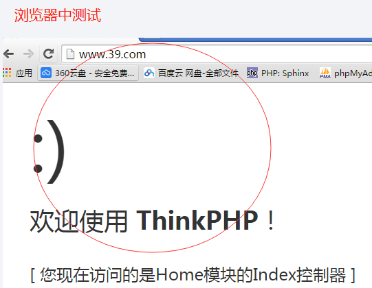
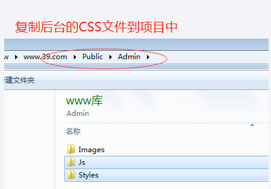
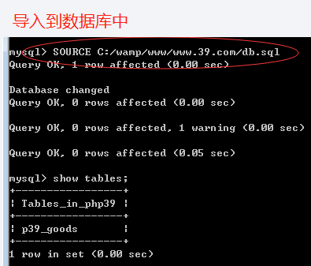
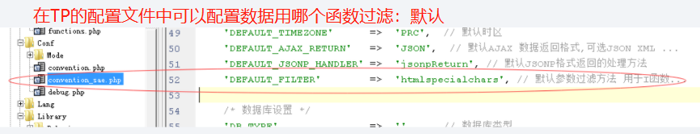
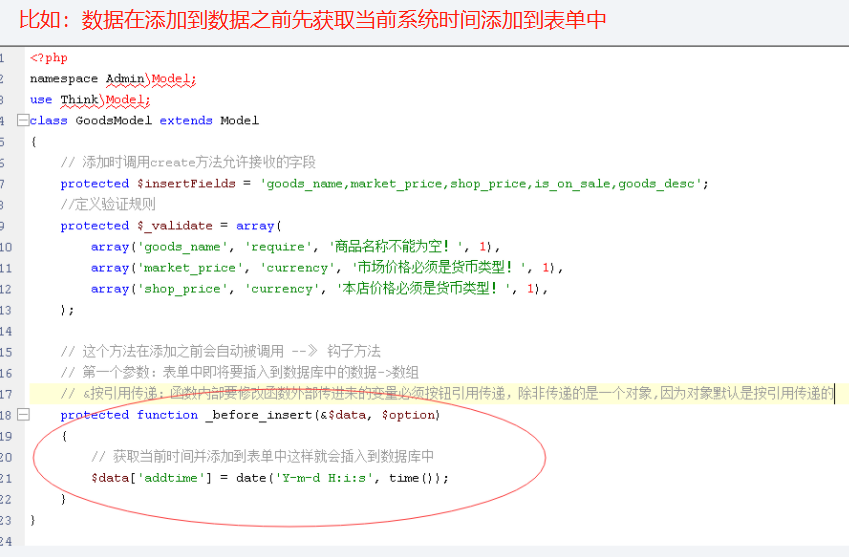
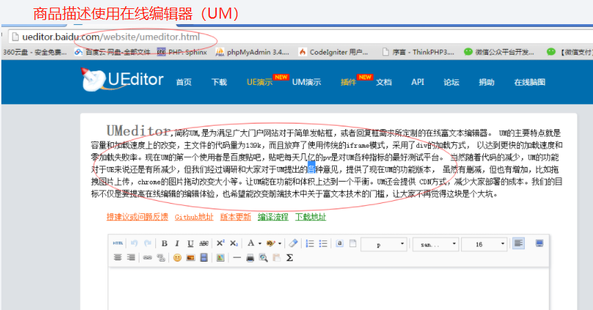
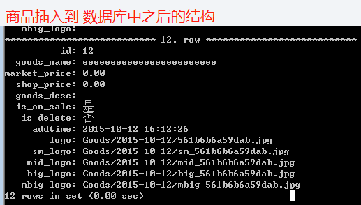

>author：MierX

>github：[StudyPhp](https://github.com/MierX/StudyPhp)

>create：21.7.21 09:10

>motto ：有志者，事竟成
---
#   01
    学习第一天的内容
##  项目介绍与代码初始化
    搭建SVN服务器：

    
    为项目导入第一批代码：

        把这个目录 配置成一个虚拟主机并运行TP的代码生成项目的目录结构：

##  规划后台目录以及导入后台模板
    先规划目录结构：

    导入后台的模板文件：

        说明：
            我们项目中没有使用smarty
            直接使用PHP的代码和少量的TP自带的标签
            直接PHP代码性能是最快的，因为如果使用标签还需要先解析标签性能会慢
            PHP新的版本【5.5】默认支持短标签，可以减少代码量，如：<?php echo $name; ?> 简写为：<?=$name;?>
##  商品表的添加操作
    学习使用TP对一张表进行完成的CRUD、搜索、排序、考虑安全（SQL注入、XSS）
    
    建商品表：

        说明：
            大文本字段需要使用全文索引，但是MYSQL中全文索引不支持中文 
            我们以后会学习SPHINX（全文索引引擎）来优化根据大文本字段查询数据的速度
        
        扩展：
            推荐使用InnoDB，因为其有很好的故障恢复功能
            MyISAM 只有插入和查询操作的时候性能更快、故障恢复能力较差，容易丢失数据

    使用TP完成添加商品的功能：

    
        扩展：
            控制器中的代码都很少，具体的业务代码都写到模型中
            然后以后会发现所有的控制器其他crud的代码基本相同
            区别就是生成不同的模型
        创建商品模型（M）：

        修改配置文件添加上DB的配置：

##  商品添加时的几个问题
    模型中表单规则的第四个参数1什么意思：

    如果表单中出现了不应该出现的字段会怎样：
        TP中的create方法默认会接收表单中所有的字段，这样就可能出现接收了一些不应该接收的字段，导致一些错误。
        解决办法：在模型中定义create方法只允许接收哪些字段

    在TP中接收用户的数据必须使用I函数接收：

##  使用钩子函数、使用在线编辑器、使用htmlpurifire过滤XSS
    在添加、修改、删除之前或者之后有时要执行一些代码，这些代码应该写到哪：
        使用钩子函数

    商品描述使用在线编辑器（UM）：

    在线编辑器中的HTML内容会TP过滤转义，这样效果就失效了：不转义会被攻击：

        解决办法：
            有选择性的过滤，只过滤掉危险的JS脚本代码、保留HTML。可以使用htmlpurifier这个开源包来做

    总结：如果项目中使用了在线编辑器需要配合使用HTMLPurifer实现有选择性的过滤XSS
##  添加商品上传logo并生成缩略图
    如何使用TP框架完成一张表的CRUD、搜索、排序、翻页、安全、图片的处理
    添加商品时为商品上传图片并生成缩略图
    
    为什么生成缩略图：
        节省带宽
        浏览加载也快
    生成几个缩略图以及多大的：
        根据前台页面图片的尺寸来的：
        列表页：130*130
        商品详情页：350*350
        商品详情页小图：50*50
        放大镜：700*700
        
    实际操作：

##  添加商品的流程
    TODO
#   02
    学习第二天的内容
##  商品列表页（搜索、翻页、排序）
##  商品的修改
##  商品的删除
##  使用模板布局制作页头和页脚
##  把图片的操作封装成函数，这样扩展性更好
##  使用GII生成一个表的代码
#   03
    学习第三天的内容
##  商品和品牌的关系（添加、修改）
##  根据品牌搜索商品
##  会员级别、会员价格的添加
##  商品表单优化
#   04
    学习第四天的内容
##  无限级的商品分类
##  分类的添加与修改
##  商品与商品分类（主分类添加和修改）
##  商品列表页中连表取出主分类名称，以及根据主分类搜索商品
##  商品扩展分类的添加和显示
##  根据分类搜索商品时同时考虑主分类和扩展分类以及子分类
##  商品分类的修改与删除
##  锁机制：解决高并发下单、抢票时出错的问题
#   05
    学习第五天的内容
##  商品属性与库存量相关表结构的设计
##  商品属性相关表图解
##  类型与属性管理
##  在添加商品时使用ajax制作属性的表单
##  商品属性的添加
##  添加商品时把类型ID保存到商品表中的type_id字段上
##  商品属性的修改（制作属性修改的表单）
##  商品属性的修改（ajax删除商品属性）
#   06
    学习第六天的内容
##  商品库存管理（添加库存量）
##  库存量的修改与删除（商品模块完成）
##  RABC：建表并生成三张主表的代码
##  权限和角色关系的添加代码
##  管理员和角色的关系
##  RABC：权限的验证（后台完成）
#   07
    学习第七天的内容
##  导入首页模板并获取前台导航条上分类的数据
##  首页中间四个商品推荐的数据获取
##  首页中间楼层数据的获取
##  前台首页加静态缓存并解决TP中雪崩的问题
##  商品详情页（浏览历史和面包屑导航）
#   08
    学习第八天的内容
##  商品详情页数据获取
##  取出商品的会员价格
##  会员的登录、注册
##  ajax判断登录的状态
##  ajax计算会员价格
##  购物车（加入购物车）
##  购物车（在登录时把cookie中的数据移动到数据库中）
##  购物车（购物车列表页）
##  购物车（导航条上ajax显示购物车中的数据）
#   09
    学习第一天的内容
##  下订单（建表和定单模型）
##  下订单（下单完成）
##  并发下单时的压力测试
##  并发下单的处理能力
##  网站集成支付宝（生成支付按钮）
##  网站集成支付宝（接收支付宝发过来的消息）
##  我的订单
#   10
    学习第十天的内容
##  商品搜索页（根据分类ID计算筛选条件）
##  商品搜索页（商品筛选条件的链接地址和显示）
##  根据选择的条件搜索商品并翻页并根据销量排序
##  四种排序
##  根据搜索出来的商品计算筛选条件
##  根据商品关键字搜索商品
#   11
    学习第十一天的内容
##  ajax发表评论
##  jqueryUI制作登录的对话框
##  ajax获取评论并翻页
##  好评率和印象的数据
##  评论回复功能
#   12
    学习第十二天的内容
##  sphinx快速入门
##  sphinx的实时自动更新
##  ajax跨域（jsonp）
##  修改数据库中的数据时更新sphinx中的属性并过滤
##  网站上线
##  网站实现QQ登录的功能